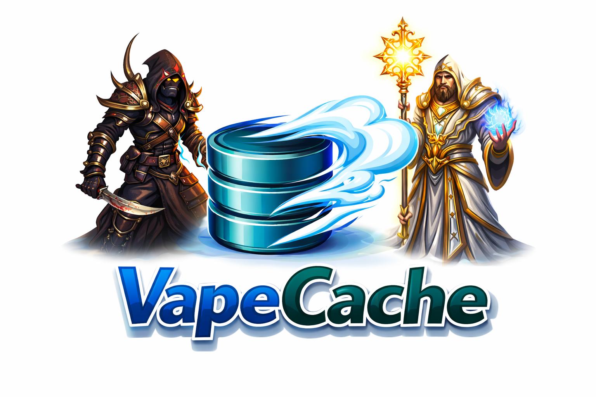

<p align="center">
  
</p>

# VapeCache

VapeCache is a Redis-first caching runtime for ASP.NET Core and .NET services.
It is designed for predictable behavior under load, Redis trouble, and high-throughput API traffic.

- Redis transport tuned for cache workloads
- Circuit-breaker and in-memory fallback for outage tolerance
- Stampede controls for hot keys
- OpenTelemetry metrics + traces
- ASP.NET Core and Aspire integrations

OSS scope in this repository: production-ready runtime packages for core caching, invalidation, ASP.NET Core integration, and Aspire integration.
For OSS/Enterprise boundaries, see [docs/OSS_VS_ENTERPRISE.md](docs/OSS_VS_ENTERPRISE.md).

## Maturity and Evidence

Current project status: `Production-Capable`.

- Production runtime features are in place, including failover paths, stampede controls, reconnect handling, and observability.
- Stability, compatibility, and release gates are documented and enforced in-repo.
- Benchmark claims follow strict disclosure rules in [docs/BENCHMARK_CLAIMS_POLICY.md](docs/BENCHMARK_CLAIMS_POLICY.md).
- Release and compatibility governance is documented in:
  - [docs/STABILITY_POLICY.md](docs/STABILITY_POLICY.md)
  - [docs/PRODUCTION_READINESS.md](docs/PRODUCTION_READINESS.md)
  - [docs/PACKAGE_COMPATIBILITY_PLAN.md](docs/PACKAGE_COMPATIBILITY_PLAN.md)

## QuickStart

1. Install packages

```bash
dotnet add package VapeCache.Runtime
dotnet add package VapeCache.Extensions.Aspire
```

If you need ASP.NET Core output-cache middleware integration:

```bash
dotnet add package VapeCache.Extensions.AspNetCore
```

If you want a DI composition facade for clean architecture wiring:

```bash
dotnet add package VapeCache.Extensions.DependencyInjection
```

If you want centralized Serilog + OTEL logging wiring with rolling file sink support and optional JSON formatting:

```bash
dotnet add package VapeCache.Extensions.Logging
```

If you need Redis pub/sub support:

```bash
dotnet add package VapeCache.Extensions.PubSub
```

If you need EF Core second-level cache interceptor contracts and invalidation bridge wiring:

```bash
dotnet add package VapeCache.Extensions.EntityFrameworkCore
```

If you need EF Core cache OpenTelemetry signals (Aspire/OTEL ready):

```bash
dotnet add package VapeCache.Extensions.EntityFrameworkCore.OpenTelemetry
```

2. Run Redis

```bash
docker run --name vapecache-redis -p 6379:6379 -d redis:7
```

3. Configure `appsettings.json`

```json
{
  "RedisConnection": {
    "Host": "localhost",
    "Port": 6379,
    "Database": 0
  },
  "CacheStampede": {
    "Profile": "Balanced"
  }
}
```

4. Register VapeCache in `Program.cs`

```csharp
using VapeCache.Abstractions.Caching;
using VapeCache.Abstractions.Connections;
using VapeCache.Extensions.Logging;
using VapeCache.Extensions.PubSub;
using VapeCache.Infrastructure.Caching;
using VapeCache.Infrastructure.Connections;

var builder = WebApplication.CreateBuilder(args);

builder.Services.AddOptions<RedisConnectionOptions>()
    .Bind(builder.Configuration.GetSection("RedisConnection"));

builder.Services.AddVapecacheRedisConnections();
builder.Services.AddVapecacheCaching();
builder.Services.AddVapeCachePubSub(); // optional: only when pub/sub is needed

builder.Services.AddOptions<CacheStampedeOptions>()
    .UseCacheStampedeProfile(CacheStampedeProfile.Balanced)
    .Bind(builder.Configuration.GetSection("CacheStampede"));
```

5. Add one endpoint

```csharp
var app = builder.Build();

app.MapGet("/products/{id:int}", async (int id, IVapeCache cache, CancellationToken ct) =>
{
    var key = CacheKey<string>.From($"products:{id}");
    var value = await cache.GetOrCreateAsync(
        key,
        _ => new ValueTask<string>($"product-{id}"),
        new CacheEntryOptions(TimeSpan.FromMinutes(5)),
        ct);

    return Results.Ok(value);
});

app.Run();
```

6. Go deeper: [docs/QUICKSTART.md](docs/QUICKSTART.md)

## ASP.NET Core Policy Ergonomics

VapeCache now supports native ASP.NET Core output-cache ergonomics for both minimal APIs and MVC while keeping the runtime engine untouched.

```csharp
builder.Services.AddVapeCacheOutputCaching();
builder.Services.AddVapeCacheAspNetPolicies(policies =>
{
    policies.AddPolicy("products", policy => policy
        .Ttl(TimeSpan.FromMinutes(5))
        .VaryByQuery()
        .Tags("products"));
});

app.MapGet("/products/{id:int}", (int id) => Results.Ok(new { id }))
   .CacheWithVapeCache("products");
```

MVC/controller attributes are also supported:

```csharp
[VapeCachePolicy("products", TtlSeconds = 300, VaryByQuery = true, CacheTags = new[] { "products" })]
public IActionResult GetProduct(int id) => Ok(new { id });
```

See:
- [docs/ASPNETCORE_POLICY_EXTENSION.md](docs/ASPNETCORE_POLICY_EXTENSION.md)
- [docs/ASPNETCORE_PIPELINE_CACHING.md](docs/ASPNETCORE_PIPELINE_CACHING.md)

## Production Packages (OSS)

| Package | NuGet | Purpose | Docs |
|---|---|---|---|
| `VapeCache.Runtime` | [VapeCache.Runtime](https://www.nuget.org/packages/VapeCache.Runtime) | Core runtime, Redis transport, fallback behavior, telemetry | [API Reference](docs/API_REFERENCE.md) |
| `VapeCache.Core` | [VapeCache.Core](https://www.nuget.org/packages/VapeCache.Core) | Shared primitives package (transitive dependency, usually not installed directly) | [Package Matrix](docs/NUGET_PACKAGES.md) |
| `VapeCache.Abstractions` | [VapeCache.Abstractions](https://www.nuget.org/packages/VapeCache.Abstractions) | Public contracts and option/value types | [API Reference](docs/API_REFERENCE.md) |
| `VapeCache.Features.Invalidation` | [VapeCache.Features.Invalidation](https://www.nuget.org/packages/VapeCache.Features.Invalidation) | Optional key/tag/zone invalidation policies | [Cache Invalidation](docs/CACHE_INVALIDATION.md) |
| `VapeCache.Extensions.DependencyInjection` | [VapeCache.Extensions.DependencyInjection](https://www.nuget.org/packages/VapeCache.Extensions.DependencyInjection) | One-call IServiceCollection wiring facade for runtime + config binding | [Quickstart](docs/QUICKSTART.md) |
| `VapeCache.Extensions.Logging` | [VapeCache.Extensions.Logging](https://www.nuget.org/packages/VapeCache.Extensions.Logging) | Optional Serilog + OTEL logging wiring with file/Seq/console sinks and pluggable JSON formatting | [Logging + Telemetry](docs/LOGGING_TELEMETRY_CONFIGURATION.md) |
| `VapeCache.Extensions.PubSub` | [VapeCache.Extensions.PubSub](https://www.nuget.org/packages/VapeCache.Extensions.PubSub) | Optional Redis pub/sub package (publish/subscribe, bounded queues, reconnect/resubscribe) | [API Reference](docs/API_REFERENCE.md) |
| `VapeCache.Extensions.EntityFrameworkCore` | [VapeCache.Extensions.EntityFrameworkCore](https://www.nuget.org/packages/VapeCache.Extensions.EntityFrameworkCore) | EF Core second-level cache interceptor contracts, deterministic query-key builder, and SaveChanges invalidation bridge wiring | [EF Core Second-Level Cache](docs/EFCORE_SECOND_LEVEL_CACHE.md) |
| `VapeCache.Extensions.EntityFrameworkCore.OpenTelemetry` | [VapeCache.Extensions.EntityFrameworkCore.OpenTelemetry](https://www.nuget.org/packages/VapeCache.Extensions.EntityFrameworkCore.OpenTelemetry) | OpenTelemetry metrics/activity package for EF Core cache interceptor events and profiler correlation | [EF Core package README](VapeCache.Extensions.EntityFrameworkCore.OpenTelemetry/README.md) |
| `VapeCache.Extensions.AspNetCore` | [VapeCache.Extensions.AspNetCore](https://www.nuget.org/packages/VapeCache.Extensions.AspNetCore) | ASP.NET Core output-cache integration | [ASP.NET Core Pipeline](docs/ASPNETCORE_PIPELINE_CACHING.md) |
| `VapeCache.Extensions.Aspire` | [VapeCache.Extensions.Aspire](https://www.nuget.org/packages/VapeCache.Extensions.Aspire) | Aspire wiring, health checks, endpoint helpers | [Aspire Integration](docs/ASPIRE_INTEGRATION.md) |

Full package install matrix: [docs/NUGET_PACKAGES.md](docs/NUGET_PACKAGES.md)

## Out Of OSS Scope

The following are not shipped from this OSS repository:

- adaptive autoscaling of multiplexed lanes
- enterprise licensing and control-plane features
- durable spill persistence package
- reconciliation package for post-outage write replay

Multiplexing itself is OSS; adaptive autoscaling is Enterprise.

## Documentation

- Start here: [docs/INDEX.md](docs/INDEX.md)
- Getting started: [docs/QUICKSTART.md](docs/QUICKSTART.md), [docs/CONFIGURATION.md](docs/CONFIGURATION.md), [docs/SETTINGS_REFERENCE.md](docs/SETTINGS_REFERENCE.md), [docs/NUGET_PACKAGES.md](docs/NUGET_PACKAGES.md)
- Core runtime: [docs/API_REFERENCE.md](docs/API_REFERENCE.md), [docs/CACHE_INVALIDATION.md](docs/CACHE_INVALIDATION.md), [docs/CACHE_TAGS_AND_ZONES.md](docs/CACHE_TAGS_AND_ZONES.md)
- ASP.NET Core: [docs/ASPNETCORE_PIPELINE_CACHING.md](docs/ASPNETCORE_PIPELINE_CACHING.md), [docs/ASPNETCORE_POLICY_EXTENSION.md](docs/ASPNETCORE_POLICY_EXTENSION.md)
- Integrations: [docs/ASPIRE_INTEGRATION.md](docs/ASPIRE_INTEGRATION.md), [docs/LOGGING_TELEMETRY_CONFIGURATION.md](docs/LOGGING_TELEMETRY_CONFIGURATION.md)
- Ops and releases: [docs/PRODUCTION_GUARDRAILS.md](docs/PRODUCTION_GUARDRAILS.md), [docs/STABILITY_POLICY.md](docs/STABILITY_POLICY.md), [docs/PRODUCTION_READINESS.md](docs/PRODUCTION_READINESS.md), [docs/RELEASE_RUNBOOK.md](docs/RELEASE_RUNBOOK.md)
- OSS and licensing: [docs/OSS_VS_ENTERPRISE.md](docs/OSS_VS_ENTERPRISE.md), [docs/LICENSE_FAQ.md](docs/LICENSE_FAQ.md)

## Build And Test

```bash
dotnet build VapeCache.slnx -c Release
dotnet test VapeCache.Tests/VapeCache.Tests.csproj -c Release
```

## License

VapeCache is licensed under the Business Source License (BUSL-1.1).

You are free to:

- use VapeCache in production
- run it in SaaS or commercial applications
- use it for internal business systems
- modify the source
- redistribute the source

You may NOT:

- offer VapeCache as a hosted caching/database service
- embed VapeCache as the core of a commercial caching/database infrastructure product

On March 11, 2029, the code will automatically convert to Apache 2.0.

See [LICENSE](LICENSE) for full terms and [docs/LICENSE_FAQ.md](docs/LICENSE_FAQ.md) for quick answers.
