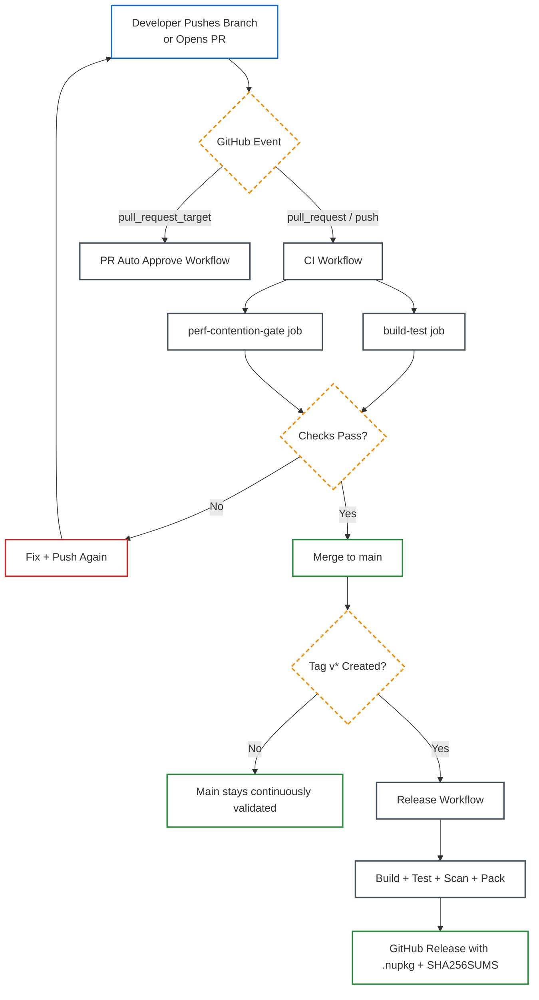

<p align="center">
  
</p>

# VapeCache

High-performance Redis caching for .NET 10 with hybrid failover, production telemetry, and enterprise control-plane capabilities.

[](https://github.com/haxxornulled/VapeCache-Enterprise/actions/workflows/ci.yml)
[](https://github.com/haxxornulled/VapeCache-Enterprise/actions/workflows/release.yml)
[](LICENSE.md)
[](https://dot.net)

## Package Map

| Package / Service | Purpose | Availability |
|---|---|---|
| `VapeCache` | Core Redis transport, caching runtime, telemetry | OSS |
| `VapeCache.Abstractions` | Contracts and value types for integration points | OSS |
| `VapeCache.Extensions.Aspire` | Aspire wiring, telemetry, endpoints | OSS |
| `VapeCache.Extensions.AspNetCore` | ASP.NET Core output cache store + middleware | OSS |
| `VapeCache.Persistence` | Durable fallback spill persistence | `(ent)` |
| `VapeCache.Reconciliation` | Re-sync persisted operations to Redis after recovery | `(ent)` |
| `VapeCache.Licensing.ControlPlane` | Online revocation / kill-switch control-plane service | `(ent)` |

`(ent)` features require enterprise licensing posture.

## Feature Inventory

All known capabilities are listed below. Enterprise-only items are marked `(ent)`.

### Core Caching Runtime

- High-throughput Redis client built for cache-heavy workloads.
- RESP2/RESP3 negotiation with HELLO fallback behavior.
- Redis cluster MOVED/ASK redirection handling for cache paths.
- Ordered multiplexing and coalesced socket writes.
- Adaptive transport tuning and runtime guardrails.
- Circuit breaker around Redis operations.
- Hybrid failover to in-memory backend when Redis is unavailable.
- Intent-aware cache entries (`CacheIntent`) for diagnostics.
- Stampede protection profiles (`Strict`, `Balanced`, `Relaxed`).
- Typed cache API (`IVapeCache`, `ICacheRegion`, `CacheKey<T>`).
- Low-level byte API (`ICacheService`) for custom serialization paths.
- Typed collections: list, set, hash, sorted set.
- Chunked large-payload stream API (`ICacheChunkStreamService`).
- Spill diagnostics snapshot surface for fallback visibility.
- Redis module command support: RedisJSON, RediSearch, RedisBloom, RedisTimeSeries.

### Integrations and Platform

- Microsoft DI registration and Autofac module registration support.
- OpenTelemetry metrics/traces via `Meter` + `ActivitySource`.
- Aspire endpoint auto-mapping + telemetry wiring.
- Aspire live metrics feed including spill diagnostics.
- ASP.NET Core output caching store backed by VapeCache.
- ASP.NET Core failover-affinity hints middleware.
- Minimal API helper extensions for output caching.
- Console host demo with GroceryStore and plugin extension points.
- Benchmark harness + perf-gate scripts for repeatable comparisons.

### Enterprise Capabilities

- Durable in-memory spill persistence to survive process restarts `(ent)`.
- Reconciliation pipeline that drains persisted operations back to Redis `(ent)`.
- License signature + claim validation runtime `(ent)`.
- Centralized enterprise feature gate enforcement `(ent)`.
- Runtime revocation checks against control-plane endpoint `(ent)`.
- API-key protected revocation/activate control-plane service `(ent)`.
- License operations runbooks and incident procedures `(ent)`.

## CI/CD Workflow (Top to Bottom)

See [docs/WORKFLOWS.md](docs/WORKFLOWS.md) for the full diagram set.

### End-to-End Flow



### CI Quality Gates

```mermaid
flowchart TB
    classDef trigger fill:transparent,stroke:#1971c2,stroke-width:2px
    classDef gate fill:transparent,stroke:#f08c00,stroke-width:2px,stroke-dasharray: 6 4
    classDef action fill:transparent,stroke:#495057,stroke-width:2px
    classDef success fill:transparent,stroke:#2b8a3e,stroke-width:2px
    classDef fail fill:transparent,stroke:#c92a2a,stroke-width:2px

    A[CI Trigger]:::trigger --> B{Parallel Jobs}:::gate

    subgraph W[build-test (windows-latest)]
      direction TB
      W1[Restore]:::action --> W2[Build Release]:::action --> W3[Unit Tests]:::action --> W4[Transport Regression Tests]:::action --> W5[Perf Gate Script]:::action
    end

    subgraph U[perf-contention-gate (ubuntu + Redis)]
      direction TB
      U1[Restore]:::action --> U2[Contention Perf Gate]:::action --> U3[Grocery Tail Perf Gate]:::action
    end

    B --> W
    B --> U
    W --> C{All Required Jobs Green?}:::gate
    U --> C
    C -->|Yes| D[PR/Merge Allowed]:::success
    C -->|No| E[Blocked Until Fixed]:::fail
```

## Quick Start

### 1) Run Redis

```bash
docker run --name vapecache-redis -p 6379:6379 -d redis:7
```

### 2) Install Core Package

```bash
dotnet add package VapeCache
```

### 3) Configure Redis (`appsettings.json`)

```json
{
  "RedisConnection": {
    "Host": "localhost",
    "Port": 6379,
    "Database": 0
  }
}
```

### 4) Register Services (`Program.cs`)

```csharp
using VapeCache.Abstractions.Caching;
using VapeCache.Infrastructure.Caching;
using VapeCache.Infrastructure.Connections;

builder.Services.AddVapecacheRedisConnections();
builder.Services.AddVapecacheCaching();
```

### 5) Use Cache API

```csharp
public sealed class PingService(ICacheService cache)
{
    public Task<string?> GetAsync(CancellationToken ct) =>
        cache.GetOrSetAsync(
            "demo:ping",
            _ => Task.FromResult("pong"),
            (writer, value) => JsonSerializer.Serialize(writer, value),
            bytes => JsonSerializer.Deserialize<string>(bytes),
            new CacheEntryOptions(Ttl: TimeSpan.FromMinutes(1)),
            ct);
}
```

## Release Automation

Release workflow is tag-driven:

1. Push tag: `git tag v1.0.2 && git push origin v1.0.2`
2. `release.yml` runs build/test/scan/pack.
3. GitHub Release is created with `.nupkg` files and `SHA256SUMS.txt`.

## Documentation

- [docs/INDEX.md](docs/INDEX.md)
- [docs/WORKFLOWS.md](docs/WORKFLOWS.md)
- [docs/QUICKSTART.md](docs/QUICKSTART.md)
- [docs/CONFIGURATION.md](docs/CONFIGURATION.md)
- [docs/API_REFERENCE.md](docs/API_REFERENCE.md)
- [docs/ASPNETCORE_PIPELINE_CACHING.md](docs/ASPNETCORE_PIPELINE_CACHING.md)
- [docs/PERFORMANCE.md](docs/PERFORMANCE.md)
- [docs/BENCHMARK_RESULTS.md](docs/BENCHMARK_RESULTS.md)
- [docs/LICENSE_OPERATIONS_RUNBOOK.md](docs/LICENSE_OPERATIONS_RUNBOOK.md)
- [docs/LICENSE_CONTROL_PLANE.md](docs/LICENSE_CONTROL_PLANE.md)

## Developer Commands

### Build

```bash
dotnet build VapeCache.sln -c Release
```

### Test

```bash
dotnet test VapeCache.Tests/VapeCache.Tests.csproj -c Release
dotnet test VapeCache.PerfGates.Tests/VapeCache.PerfGates.Tests.csproj -c Release
```

### Pack

```bash
dotnet pack VapeCache.sln -c Release --no-build
```

## License

Community use is licensed under [LICENSE.md](LICENSE.md) (non-commercial only).  
Commercial use requires a paid Enterprise license.
