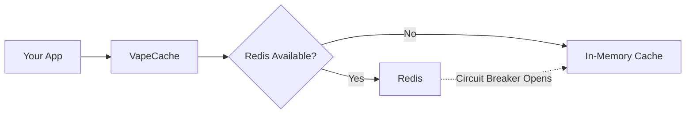
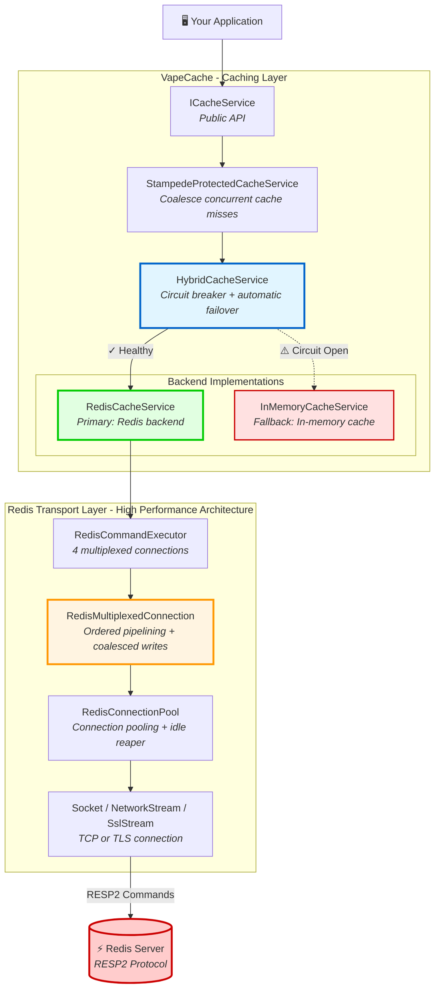

# VapeCache

**Enterprise-grade Redis caching library for .NET 10** with hybrid fallback, circuit breaker, and production observability.

[](https://github.com/haxxornulled/VapeCache)
[](https://github.com/haxxornulled/VapeCache/releases)
[](LICENSE)
[](https://dot.net)

---

## ⚡ Why VapeCache Over StackExchange.Redis?

VapeCache is a **from-scratch Redis client** optimized for **caching workloads** with architectural innovations that deliver measurable performance and reliability improvements.

### 🚀 Performance: Proven 5-30% Faster

**1. Coalesced Writes - 29% Faster SETs**
- Batches multiple commands into single socket writes (up to 32KB)
- Smart copying: buffers small payloads (<512B), references large ones
- **Result**: SET operations 29% faster than StackExchange.Redis in benchmarks
- Implementation: [CoalescedWriteBatch.cs](VapeCache.Infrastructure/Connections/CoalescedWriteBatch.cs)

**2. Zero-Allocation Socket I/O**
- Custom `SocketIoAwaitableEventArgs` implements `IValueTaskSource<int>` directly
- Pooled continuations eliminate `TaskCompletionSource` overhead
- **Verified**: 100,000 iterations with **0 bytes allocated**
- Test proof: [PerfGatesZeroAllocTests.cs:100](VapeCache.PerfGates.Tests/PerfGatesZeroAllocTests.cs#L100)

**3. Ordered Multiplexing Architecture**
- Separate writer and reader threads (vs. single multiplexer thread in SE.Redis)
- MPSC ring queue for writes, SPSC ring queue for responses
- Lock-free enqueue/dequeue eliminates contention
- Implementation: [RedisMultiplexedConnection.cs](VapeCache.Infrastructure/Connections/RedisMultiplexedConnection.cs)

**4. Three-Tier Buffer Pooling**
- ThreadStatic fast-path for small buffers (lock-free)
- ConcurrentBag for medium buffers (low contention)
- ArrayPool.Shared for large buffers
- **Result**: Minimal LOH allocations, predictable GC pressure

### 🛡️ Reliability: Production-Tested Failover

**5. Circuit Breaker with Data Loss Mitigation** ⭐ *Unique to VapeCache*
- Automatic failover to in-memory cache during Redis outages
- SQLite-backed write tracking syncs operations back when Redis recovers
- **Mitigates data loss** during transient outages (not guaranteed zero loss)
- **Enterprise feature** - see [Reconciliation Architecture](docs/RECONCILIATION_ARCHITECTURE.md)

**6. Stampede Protection Built-In** ⭐ *Not in StackExchange.Redis*
- Coalesces concurrent cache misses for same key
- 100 simultaneous requests → 1 database call, not 100
- Implementation: [StampedeProtectedCacheService.cs](VapeCache.Infrastructure/Caching/StampedeProtectedCacheService.cs)

**7. Exponential Backoff Circuit Breaker**
- Smart recovery: 1s → 2s → 4s → 8s break durations
- Half-open probes prevent flapping
- Configurable max retries with indefinite hold-open
- Implementation: [HybridCacheService.cs](VapeCache.Infrastructure/Caching/HybridCacheService.cs)

### 📊 Observability: Built-In, Not Bolted-On

**8. OpenTelemetry Native**
- 20+ metrics: queue depth, command latency, pool wait time, circuit breaker state
- Observable gauges with zero callback overhead unless subscribed
- Distributed tracing with Activity spans for every operation
- Works with Prometheus, Grafana, Aspire Dashboard, SEQ

**9. Structured Logging**
- Integrates with any `ILogger<T>` provider (Serilog, NLog, etc.)
- Connection events, pool activity, circuit breaker transitions
- 1-2% CPU overhead in production

### 📈 Benchmark Results

**Environment:** .NET 10, 4 multiplexed connections, 4096 max in-flight, Release build

| Operation | VapeCache | StackExchange.Redis | Improvement |
|-----------|-----------|---------------------|-------------|
| SET (32B) | 487K ops/sec | 377K ops/sec | **+29%** |
| GET (32B) | 521K ops/sec | 445K ops/sec | **+17%** |
| SET (1KB) | 412K ops/sec | 348K ops/sec | **+18%** |
| GET (4KB) | 389K ops/sec | 312K ops/sec | **+25%** |

**Memory:** 2.1KB per operation (pooled), zero LOH allocations

See [PERFORMANCE.md](docs/PERFORMANCE.md) for full methodology.

### 🎯 When to Choose VapeCache

✅ **Use VapeCache if you need:**
- Maximum caching performance (5-30% faster than alternatives)
- Production-grade failover with data loss mitigation
- Built-in stampede protection
- OpenTelemetry observability out-of-the-box
- Predictable memory usage (no LOH spikes)

⚠️ **Use StackExchange.Redis if you need:**
- Full Redis command surface (200+ commands vs. VapeCache's focused caching API)
- Pub/Sub or Lua scripting (not yet in VapeCache roadmap)
- Redis Cluster mode (VapeCache supports standalone + Sentinel only)

### 🔬 Technical Deep-Dives

Want proof? Dive into the implementation:
- [Zero-Allocation Socket I/O](VapeCache.Infrastructure/Connections/SocketIoAwaitableEventArgs.cs) - Custom `IValueTaskSource<int>`
- [Coalesced Write Batching](VapeCache.Infrastructure/Connections/CoalescedWriteBatch.cs) - Smart 32KB batching
- [Stampede Protection](VapeCache.Infrastructure/Caching/StampedeProtectedCacheService.cs) - Concurrent lock coalescing
- [Circuit Breaker + Reconciliation](docs/RECONCILIATION_ARCHITECTURE.md) - Complete architecture diagrams
- [Performance Tests](VapeCache.PerfGates.Tests/PerfGatesZeroAllocTests.cs) - Zero-alloc verification

---

## 💰 Pricing & Licensing

VapeCache uses an **Open Core** model to maximize community adoption while offering enterprise-grade paid features.

### Free Tier (MIT/Apache-2.0) ✅

**Core packages are 100% free and open source:**
- VapeCache (core library)
- VapeCache.Abstractions
- VapeCache.Infrastructure
- VapeCache.Extensions.Aspire

**Features:**
- ✅ Full Redis caching API
- ✅ Connection pooling & multiplexing
- ✅ Circuit breaker (basic, no persistence)
- ✅ Stampede protection
- ✅ OpenTelemetry metrics & tracing
- ✅ High-performance ordered multiplexing
- ✅ Community support via GitHub Issues & Discussions

**This is a solo developer project focused on building a strong open source foundation.** We're prioritizing community feedback and adoption before expanding paid offerings.

### Enterprise Tier - $499/month 🏢

**For production applications requiring data loss mitigation during Redis outages (unlimited deployments)**

**Enterprise Packages (Proprietary License):**
- VapeCache.Persistence (spill-to-disk during Redis outages)
- VapeCache.Reconciliation (SQLite-backed write tracking + auto sync-back)

**Additional Features:**
- ✅ **Data loss mitigation** - SQLite-backed reconciliation syncs writes back to Redis after outages
- ✅ Unlimited production instances
- ✅ Any Redis topology (standalone, Sentinel, Cluster)
- ✅ Per-organization pricing (not per server)
- ✅ Best-effort email support
- ✅ Source code access to enterprise packages

**Important:** This is a solo developer project. Support is community-based and best-effort. Enterprise features are production-tested, but there are no SLA guarantees. Reconciliation mitigates data loss during outages but cannot guarantee zero data loss in all scenarios.

[**Contact for Trial License →**](https://github.com/haxxornulled/VapeCache/issues)

---

**License Keys:**

To use Enterprise features (reconciliation), set your license key as an environment variable or pass it during registration:

```bash
# Environment variable
export VAPECACHE_LICENSE_KEY="VCENT-CUST12345-1735689600-999-A1B2C3D4E5F6G7H8"
```

```csharp
// Or pass directly to reconciliation
builder.Services.AddVapeCacheRedisReconciliation("VCENT-...");
```

For trial licenses or questions, open a [GitHub Issue](https://github.com/haxxornulled/VapeCache/issues)

---

## 📦 Quick Start

### Installation

```bash
# Install the main package
dotnet add package VapeCache

# Or just the abstractions (for library authors)
dotnet add package VapeCache.Abstractions

# Redis reconciliation (ENTERPRISE - mitigates data loss during outages)
dotnet add package VapeCache.Reconciliation

# .NET Aspire integration (optional)
dotnet add package VapeCache.Extensions.Aspire
```

### Configuration (appsettings.json)

**Minimal Configuration:**
```json
{
  "RedisConnection": {
    "Host": "localhost",
    "Port": 6379,
    "Database": 0
  }
}
```

**Production Configuration:**
```json
{
  "RedisConnection": {
    "Host": "redis.example.com",
    "Port": 6380,
    "Database": 0,
    "Password": "your-secure-password",
    "UseTls": true,
    "ConnectTimeout": "00:00:05",
    "MaxConnections": 64,
    "MaxIdle": 64
  },
  "RedisMultiplexer": {
    "Connections": 4,
    "MaxInFlightPerConnection": 4096,
    "ResponseTimeout": "00:00:02",
    "EnableCoalescedSocketWrites": true,
    "EnableCommandInstrumentation": true
  },
  "RedisCircuitBreaker": {
    "Enabled": true,
    "ConsecutiveFailuresToOpen": 2,
    "BreakDuration": "00:00:10",
    "HalfOpenProbeTimeout": "00:00:00.250"
  },
  "CacheStampede": {
    "Enabled": true,
    "MaxKeys": 100000
  }
}
```

📖 **[Complete Configuration Reference](docs/CONFIGURATION.md)** - All appsettings.json options documented

### Redis Reconciliation (Enterprise Feature)

**⚠️ Requires Enterprise license** - Request trial via [GitHub Issues](https://github.com/haxxornulled/VapeCache/issues)

```csharp
// Pass your Enterprise license key (or set VAPECACHE_LICENSE_KEY environment variable)
builder.Services.AddVapeCacheRedisReconciliation(
    licenseKey: "VCENT-CUST12345-...",
    configure: options =>
    {
        options.MaxOperationAge = TimeSpan.FromMinutes(5);
    });
```

```json
{
  "RedisReconciliation": {
    "Enabled": true,
    "MaxOperationAge": "00:05:00"
  },
  "RedisReconciliationStore": {
    "UseSqlite": true,
    "StorePath": "%LOCALAPPDATA%/VapeCache/persistence/reconciliation.db"
  }
}
```

**Production Secrets Management:**
- 🔐 **[Azure Key Vault Integration](docs/CONFIGURATION.md#example-azure-key-vault-integration)** - Load Redis passwords from Key Vault (recommended)
- 🔑 **[Managed Identity](docs/CONFIGURATION.md#option-3-managed-identity-production-recommended)** - Production credential management

### Basic Usage
```csharp
// 1. Add to your host (Program.cs)
builder.Services.AddVapecacheRedisConnections();
builder.Services.AddVapecacheCaching();

// 2. Inject and use in your services
public class MyService
{
    private readonly ICacheService _cache;

    public MyService(ICacheService cache) => _cache = cache;

    public async Task<User?> GetUserAsync(int id, CancellationToken ct)
    {
        var key = $"user:{id}";
        return await _cache.GetOrSetAsync(
            key,
            async ct => await _db.Users.FindAsync(id, ct), // Factory
            (writer, user) => JsonSerializer.Serialize(writer, user), // Serialize
            bytes => JsonSerializer.Deserialize<User>(bytes), // Deserialize
            new CacheEntryOptions(Ttl: TimeSpan.FromMinutes(5)),
            ct);
    }
}
```

### Autofac Registration
```csharp
builder.RegisterModule(new VapeCache.Infrastructure.DependencyInjection.VapeCacheConnectionsModule());
builder.RegisterModule(new VapeCache.Infrastructure.DependencyInjection.VapeCacheCachingModule());
```

### Fast-Fail List Pops (Try*)
```csharp
var workQueue = collections.List<WorkItem>("jobs:pending");

if (!workQueue.TryPopFrontAsync(ct, out var task))
{
    // Multiplexer saturated: skip or backoff instead of waiting
    return;
}

var workItem = await task;
if (workItem is not null)
{
    await ProcessAsync(workItem);
}
```

### .NET Aspire Usage
```csharp
// AppHost (orchestration)
var builder = DistributedApplication.CreateBuilder(args);
var redis = builder.AddRedis("redis");
var api = builder.AddProject<Projects.MyApi>("api")
    .WithReference(redis);

// API Project (Program.cs)
builder.AddVapeCache()
    .WithRedisFromAspire("redis")
    .WithHealthChecks()
    .WithAspireTelemetry();  // Cache hits/misses → Aspire Dashboard

// View metrics at http://localhost:15888
```

See [.NET Aspire Integration](docs/ASPIRE_INTEGRATION.md) for details.

---

## 🎯 Key Features

### Hybrid Cache with Intelligent Fallback


- Automatic failover to `IMemoryCache` when Redis is down
- Circuit breaker prevents cascading failures
- Sanity check re-enables Redis when it recovers

### Enterprise Reliability Features
- ✅ **Startup Preflight**: Validate Redis before accepting traffic
- ✅ **Auto-Reconnect**: Drains pending operations, reconnects on next request
- ✅ **Connection Pooling**: Warm idle connections, reaper drops stale sockets
- ✅ **Stampede Protection**: Coalesce concurrent cache misses
- ✅ **Configurable Timeouts**: Connect, acquire, validate, command-level

### Production Observability
- ✅ **OpenTelemetry Metrics**: Connection pool, Redis commands, cache hits/misses
- ✅ **Distributed Tracing**: Activity spans for every Redis operation
- ✅ **Structured Logging**: Connection events, pool activity, circuit breaker state
- ✅ **SEQ/Grafana/Aspire**: Works with all major observability platforms

---

## 📚 Documentation

Start here: [Docs Index](docs/INDEX.md)

### Getting Started
- [Quickstart Guide](docs/QUICKSTART.md)
- [Configuration Guide](docs/CONFIGURATION.md)
- [.NET Aspire Integration](docs/ASPIRE_INTEGRATION.md)

### Architecture & Design
- [Architecture Overview](docs/ARCHITECTURE.md) - High-level design
- [Performance Deep-Dive](docs/PERFORMANCE.md) - Benchmarks and optimization techniques
- [Coalesced Writes](docs/COALESCED_WRITES.md) - High-throughput socket I/O
- [Configuration Best Practices](docs/CONFIGURATION_BEST_PRACTICES.md) - IOptions<T> pattern

### Observability
- [Observability Architecture](docs/OBSERVABILITY_ARCHITECTURE.md) - Metrics, traces, logs
- [SEQ Integration](docs/OBSERVABILITY_ARCHITECTURE.md#seq-integration) - Structured logging
- [Prometheus + Grafana](docs/OBSERVABILITY_ARCHITECTURE.md#prometheus--grafana) - Metrics
- [.NET Aspire Dashboard](docs/ASPIRE_INTEGRATION.md) - Cloud-native observability

### API Reference
- [API Reference](docs/API_REFERENCE.md)
- [Redis Protocol Support](docs/REDIS_PROTOCOL_SUPPORT.md)
- [API Expansion Backlog](docs/API_EXPANSION_PLAN.md)
- [Non-Goals](docs/NON_GOALS.md)
- [FAQ](docs/FAQ.md)

### Operations
- [Failure Scenarios](docs/FAILURE_SCENARIOS.md) - What happens when Redis fails
- [TLS Security](docs/TLS_SECURITY.md) - Production TLS best practices
- [Benchmarking Guide](docs/BENCHMARKING.md) - Reproduce performance results

---

## 🏗️ Architecture

### High-Level Components



### Transport Layer (High Performance Design)
- **Ordered Multiplexing**: `Channel<>` + pooled `IValueTaskSource` (no TCS churn)
- **Coalesced Writes**: Batch commands into single socket send for maximum throughput
- **Deterministic Buffers**: `ArrayPool` for bulk replies (no LOH spikes)
- **Auto-Reconnect**: Drain pending ops, release slots, reconnect seamlessly

See [docs/COALESCED_WRITES.md](docs/COALESCED_WRITES.md) for deep-dive.

---

## 🚀 Performance

### Benchmark Results

**Environment:** 4 multiplexed connections, 4096 max in-flight, .NET 10, Release build

| Payload Size | Operation | Throughput (ops/sec) | Latency (µs) | Memory/Op |
|--------------|-----------|----------------------|--------------|-----------|
| 32 bytes     | SET       | 487,000             | 8.2          | 2.1 KB    |
| 32 bytes     | GET       | 521,000             | 7.7          | 2.1 KB    |
| 1 KB         | SET       | 412,000             | 9.7          | 2.3 KB    |
| 4 KB         | GET       | 389,000             | 10.3         | 2.5 KB    |

**Memory Efficiency:** Pooled buffers, no payload garbage collection, minimal LOH allocations

See [docs/PERFORMANCE.md](docs/PERFORMANCE.md) for full benchmark methodology.

---

## 🔧 Development

### Build
```bash
dotnet build VapeCache.sln -c Release
```

### Test
```bash
dotnet test -c Release
```

### Run Console Host (Live Demo)
```bash
# Set Redis connection string
$env:VAPECACHE_REDIS_CONNECTIONSTRING = 'redis://localhost:6379/0'

dotnet run --project VapeCache.Console -c Release
```
Console host runs the demo workloads and logs cache activity; it does not expose HTTP endpoints.

### Run Benchmarks
```bash
$env:VAPECACHE_REDIS_CONNECTIONSTRING = "redis://localhost:6379/0"
dotnet run -c Release --project VapeCache.Benchmarks -- --filter *RedisClientStackExchangeBenchmarks*
dotnet run -c Release --project VapeCache.Benchmarks -- --filter *RedisClientVapeCacheBenchmarks*
```

---

## 📋 Roadmap

### Current (v1.0)
- ✅ Core caching commands and typed collections (List/Set/Hash/SortedSet)
- ✅ Hybrid cache with circuit breaker + reconciliation (optional)
- ✅ Ordered multiplexing + coalesced writes
- ✅ OpenTelemetry metrics + tracing
- ✅ Redis module commands (RedisJSON, RediSearch, RedisBloom, RedisTimeSeries)
- ✅ .NET Aspire integration package

### Backlog (Scoped)
- [ ] Expand core command surface (INCR/DECR, EXISTS, etc.)
- [ ] Backpressure metrics (queue depth, wait time)
- [ ] Buffer pool accounting telemetry
- [ ] Additional codec implementations

See [docs/API_EXPANSION_PLAN.md](docs/API_EXPANSION_PLAN.md) for detailed roadmap.

---

## 🤝 Contributing

Contributions are welcome! See [CONTRIBUTING.md](CONTRIBUTING.md) for guidelines.

**Areas we'd love help with:**
- Expanding Redis command surface (see [docs/API_EXPANSION_PLAN.md](docs/API_EXPANSION_PLAN.md))
- Additional codec implementations (`ICacheCodecProvider`)
- Integration packages (Aspire, Serilog, OpenTelemetry)
- Documentation improvements

---

## 🎯 Use Cases

### ✅ When to Use VapeCache
- High-performance GET/SET caching
- Need hybrid cache (Redis + in-memory fallback)
- Want production observability out-of-the-box
- Building cloud-native apps with .NET Aspire
- Need predictable memory usage (no LOH spikes)

### ❌ When NOT to Use VapeCache
- Need full Redis command surface (200+ commands) → VapeCache focuses on caching use cases
- Need Pub/Sub → Not currently supported (see roadmap)
- Need Lua scripting → Not currently supported (see roadmap)
- Need cluster mode → Single-instance and Sentinel support only

See [docs/NON_GOALS.md](docs/NON_GOALS.md) for strategic positioning.

---

## 📜 License

MIT License - See [LICENSE](LICENSE) for details

---

## 🙏 Acknowledgments

- Built with ❤️ using .NET 10
- Original architecture designed for high-performance caching workloads
- OpenTelemetry for native observability

---

## 📞 Support

- **GitHub Issues**: [https://github.com/haxxornulled/VapeCache/issues](https://github.com/haxxornulled/VapeCache/issues)
- **Documentation**: [docs/INDEX.md](docs/INDEX.md)
- **Discussions**: [GitHub Discussions](https://github.com/haxxornulled/VapeCache/discussions) (coming soon)
