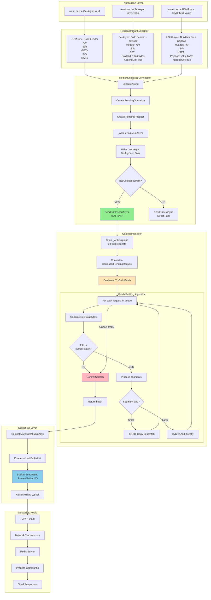
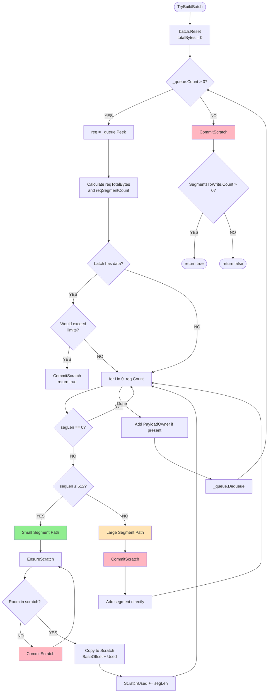
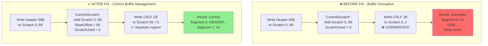
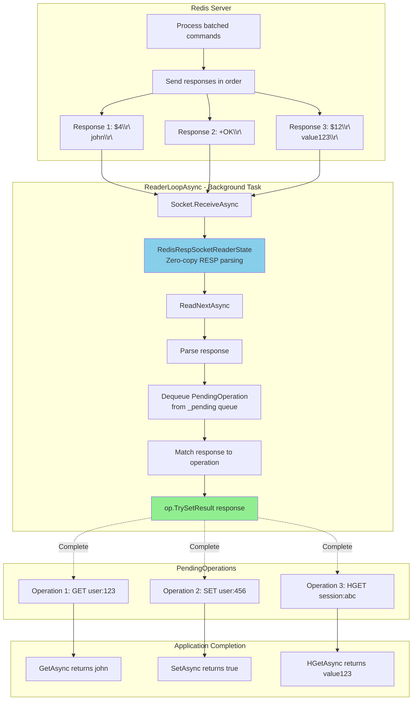
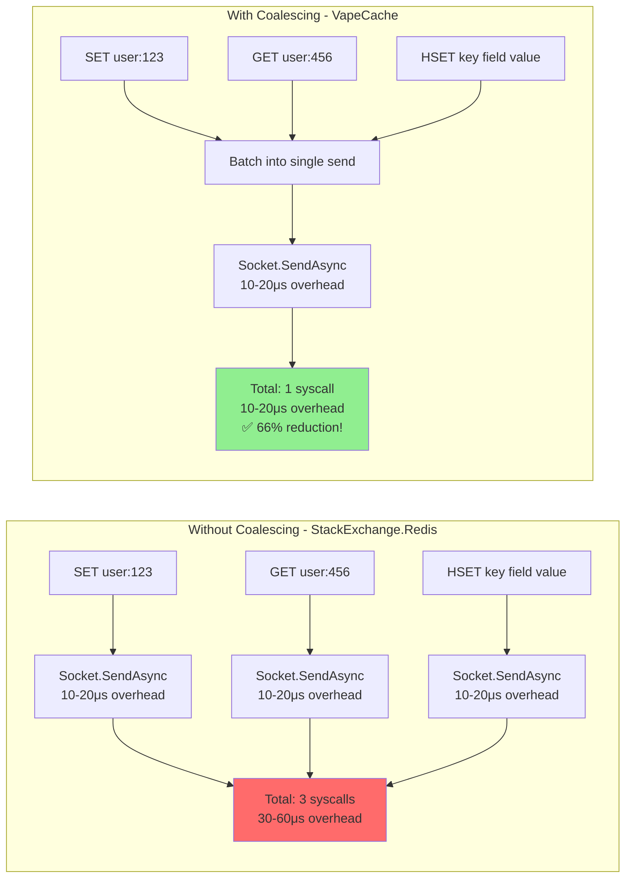
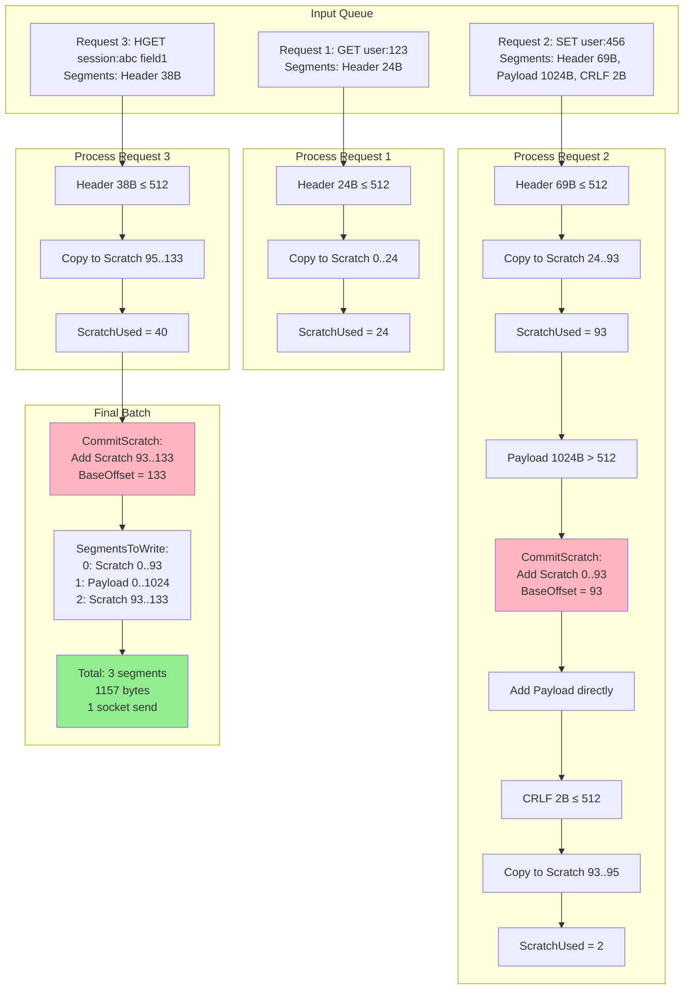
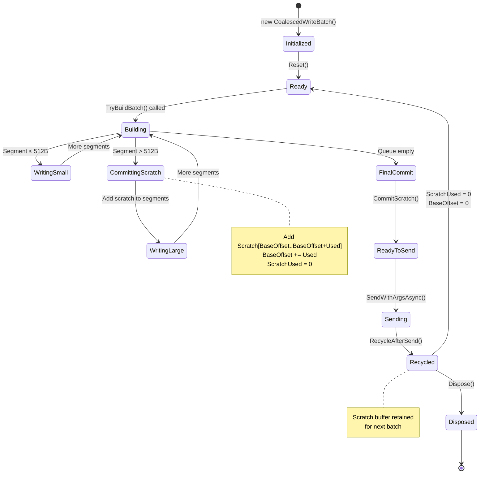

# Coalesced Writes - Flow Diagrams

This document contains visual flow diagrams for VapeCache's coalesced socket writes feature.

## Complete Request Flow (Client → Redis)

## Coalescer Algorithm (Detailed)

## Scratch Buffer Management (The Fix)

## Response Flow (Redis → Client)

## Performance Comparison

## Batch Building Example

## State Machine: CoalescedWriteBatch Lifecycle

---

**Legend**:
- 🟢 Green: Optimized hot path
- 🟡 Yellow: Batch building logic
- 🔴 Red: Critical fix areas
- 🔵 Blue: Socket I/O operations

**Related Documentation**:
- [COALESCED_WRITES.md](COALESCED_WRITES.md) - Complete documentation
- [BENCHMARK_DEBUGGING_SUMMARY.md](../BENCHMARK_DEBUGGING_SUMMARY.md) - Debugging timeline

**Last Updated**: December 25, 2025
