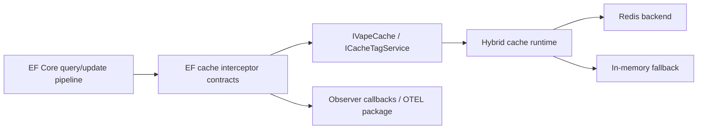
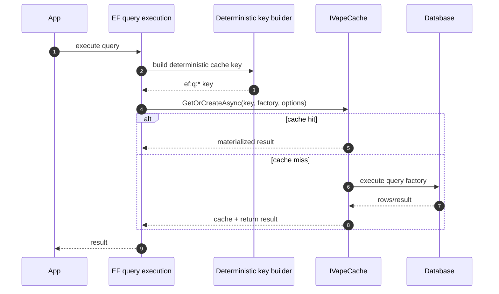
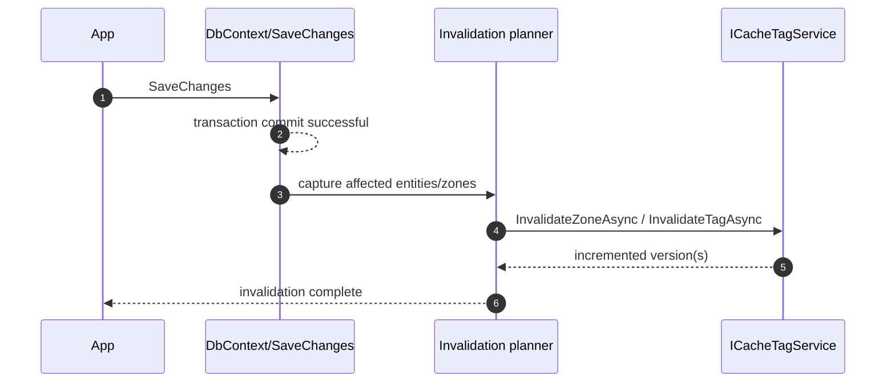
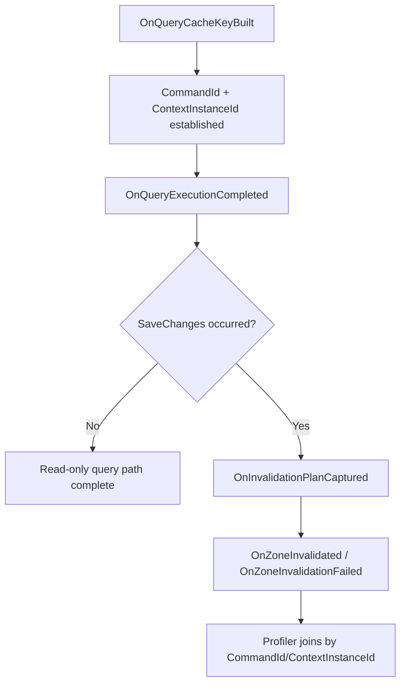

# EF Core Second-Level Cache

This document specifies how EF Core second-level caching integrates with VapeCache architecture.

## 1. Current Status

Current OSS runtime provides the primitives required for EF-style second-level caching:

- typed cache API (`IVapeCache`)
- tag/zone invalidation (`ICacheTagService`)
- invalidation dispatch/policy infrastructure (`VapeCache.Features.Invalidation`, `VapeCache.Application.Caching.Invalidation`)
- EF adapter/interceptor contract package (`VapeCache.Extensions.EntityFrameworkCore`)

The first-party package currently provides interceptor contracts and bridge wiring; it does not yet claim full transparent result materialization caching for all query shapes.

### 1.1 Integration Topology



## 1.1 Package Wiring

```csharp
builder.Services.AddVapeCacheEntityFrameworkCore();

builder.Services.AddDbContext<MyDbContext>((sp, db) =>
{
    db.UseSqlServer(connectionString);
    db.UseVapeCacheEntityFrameworkCore(sp);
});
```

## 1.2 Profiler Integration Visibility

The EF adapter exposes a public observer contract:

- `IEfCoreSecondLevelCacheObserver`
- OTEL package: `VapeCache.Extensions.EntityFrameworkCore.OpenTelemetry`

Observer callbacks are opt-in (`EnableObserverCallbacks = false` by default) to preserve zero-overhead behavior in default runtime configuration.

Key events for correlation in profiler tools:

- `OnQueryCacheKeyBuilt` (`CommandId`, `ContextInstanceId`, `CacheKey`, provider, parameter count)
- `OnQueryExecutionCompleted` (same correlation IDs + duration/success/failure)
- `OnInvalidationPlanCaptured` (zones mapped from tracked entity writes)
- `OnZoneInvalidated` / `OnZoneInvalidationFailed`

Register your profiler observer as a normal DI singleton.

For OpenTelemetry/Aspire pipelines, install and register:

```csharp
builder.Services.AddVapeCacheEntityFrameworkCore();
builder.Services.AddVapeCacheEfCoreOpenTelemetry();

builder.Services.AddOpenTelemetry()
    .WithMetrics(m => m.AddMeter("VapeCache.EFCore.Cache"))
    .WithTracing(t => t.AddSource("VapeCache.EFCore.Cache"));
```

If you use `VapeCache.Extensions.Aspire`, `WithAspireTelemetry()` already registers `VapeCache.EFCore.Cache` meter/source for you.

Example normalized stream shape:

```csharp
public sealed record EfProfilerEvent(
    DateTimeOffset TimestampUtc,
    EfProfilerEventType EventType,
    Guid CommandId,
    Guid ContextInstanceId,
    string? CacheKey,
    string? Zone,
    long? ZoneVersion,
    double? DurationMs,
    bool? Succeeded,
    string? FailureType,
    string? FailureMessage,
    IReadOnlyList<string>? PlannedZones);
```

Correlation guidance:

- use `CommandId` to join `OnQueryCacheKeyBuilt` and `OnQueryExecutionCompleted`
- use `ContextInstanceId` to join `OnInvalidationPlanCaptured`, `OnZoneInvalidated`, and failures

## 2. Architectural Constraint

EF Core is an adapter concern and must stay outside core runtime logic.

- no `DbContext`/EF types in `VapeCache.Core` or `VapeCache.Infrastructure` cache internals
- EF-specific interception/materialization belongs in an extension adapter package
- invalidation and key policies should reuse existing abstractions instead of duplicating logic

## 3. Read Path Pattern (Supported Today)

Use deterministic query keys and zone/tag metadata:

1. build deterministic key for query shape + parameters
2. call `IVapeCache.GetOrCreateAsync(...)`
3. set TTL and attach entity zones/tags using `CacheEntryOptions.WithZone(...)` / `WithTags(...)`

Example (pattern):

```csharp
var key = CacheKey<IReadOnlyList<ProductDto>>.From("ef:q:products:by-category:electronics:v1");

var value = await cache.GetOrCreateAsync(
    key,
    async ct => await db.Products
        .Where(p => p.Category == "electronics")
        .Select(p => new ProductDto(p.Id, p.Name))
        .ToListAsync(ct),
    new CacheEntryOptions(TimeSpan.FromMinutes(5)).WithZone("ef:products"),
    ct);
```

### 3.1 Read Path Sequence



## 4. Write/Invalidation Pattern (Supported Today)

After a successful write transaction (`SaveChanges`), invalidate affected entity zones/tags.

Options:

- direct runtime invalidation:
  - `InvalidateZoneAsync("ef:products")`
- policy-driven invalidation:
  - publish `InvalidateEntityCacheCommand`
- use `EntityCacheChangedEvent`-based policies

### 4.1 Write + Invalidation Sequence



## 5. Deterministic Query Key Requirements

EF query keys used for second-level caching should include:

- query identity (logical name or normalized expression hash)
- parameter values (stable order)
- tenant/scope dimensions when relevant
- schema/version segment for serialization/query-shape changes

Recommended namespace:

- `ef:q:{bounded-context}:{query-name}:{hash-or-parameter-signature}:v{n}`

Avoid keys that depend on non-deterministic values unless intended.

## 6. Invalidation Requirements

Second-level cache integration must support coarse and targeted invalidation:

- coarse: zone invalidation per aggregate/table (`ef:products`)
- targeted: tag invalidation per entity (`product:{id}`)
- optional direct key invalidation for precomputed query keys

Preferred default: use zones for table/aggregate invalidation, tags for entity-level precision.

## 7. Transaction Boundary Rules

- only invalidate after successful persistence commit
- do not invalidate on failed/rolled-back writes
- if using outbox/event-driven writes, publish invalidation events from the same consistency boundary

## 8. Failure and Consistency Behavior

Under Redis failure, hybrid runtime may serve fallback memory depending on breaker state.
Implications for EF second-level cache:

- cache remains available per-node via fallback
- in multi-node deployments, fallback memory is node-local
- use distributed invalidation (Redis tag versions) as source of truth when Redis is healthy

## 9. Adapter Contract (Recommended)

A future EF adapter package should provide:

- deterministic key builder for EF queries
- interception points for query materialization and cache population
- save pipeline hooks to emit invalidation events/zones
- no direct dependency from core runtime packages on EF assemblies

## 10. Testing Requirements

Any EF adapter implementation should include:

- key determinism tests (same query + params -> same key)
- invalidation correctness tests after writes
- fallback behavior tests during Redis outages
- concurrency tests for stampede/coalesced misses on hot EF queries

### 10.1 Observer Correlation Model


