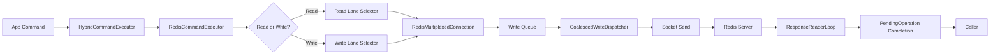
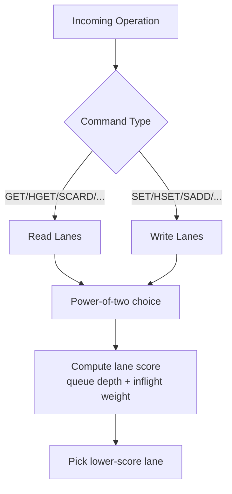
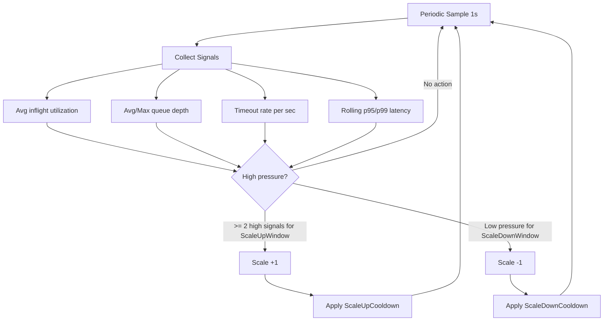
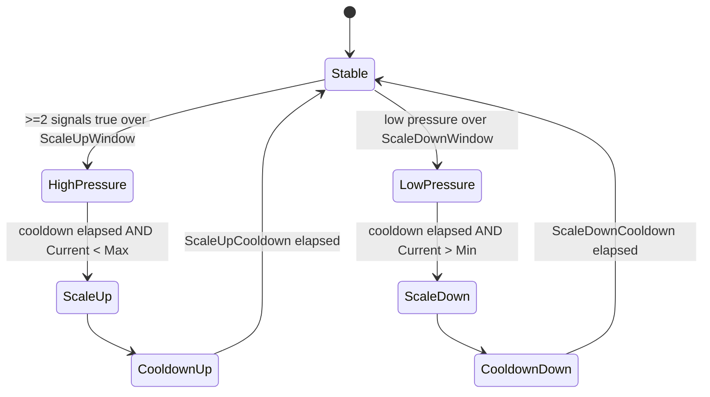

# Enterprise Multiplexer + Autoscaler

This document explains VapeCache multiplexed connection internals and the autoscaler control loop.

For a code-level fast-path flow and lane-management diagram set, see [MUX_FAST_PATH_ARCHITECTURE.md](MUX_FAST_PATH_ARCHITECTURE.md).

## Scope and Edition

- Multiplexed connections (`RedisMultiplexerOptions`) are available in OSS.
- **Adaptive autoscaling of multiplexed lanes is Enterprise-only.**
- In OSS-safe deployments, keep `RedisMultiplexer:EnableAutoscaling=false`.

## Design Goals

- Improve sustained throughput under high concurrency.
- Reduce p95/p99/p999 by reducing queue pressure and lane hot spots.
- Avoid connection thrash with bounded, hysteresis-based scaling.

## Runtime Flow



## Lane Selection



## Autoscaler Control Loop (Enterprise)



## Hysteresis Model



## Settings / Knobs

`RedisMultiplexer` settings:

| Setting | Type | What It Does | Guidance |
|---|---|---|---|
| `Connections` | int | Initial multiplexed connection count | Start 4-8, benchmark |
| `MaxInFlightPerConnection` | int | Per-lane outstanding op cap | Increase for high concurrency |
| `EnableCoalescedSocketWrites` | bool | Enables coalesced packet writes | Keep `true` for throughput |
| `ResponseTimeout` | timespan | Per-command response timeout | `00:00:00` disables |
| `EnableAutoscaling` | bool | Enables autoscaler loop | **Enterprise-only** |
| `MinConnections` | int | Lower autoscaler bound | 2-8 typical |
| `MaxConnections` | int | Upper autoscaler bound | Hard safety cap |
| `AutoscaleSampleInterval` | timespan | Sampling period | 1s typical |
| `ScaleUpWindow` | timespan | Sustained high-pressure window | 5-15s |
| `ScaleDownWindow` | timespan | Sustained low-pressure window | 2-5 min |
| `ScaleUpCooldown` | timespan | Cooldown after scale-up | 15-30s |
| `ScaleDownCooldown` | timespan | Cooldown after scale-down | 60-300s |
| `ScaleUpInflightUtilization` | double | Scale-up inflight threshold | 0.70-0.85 |
| `ScaleDownInflightUtilization` | double | Scale-down inflight threshold | 0.15-0.30 |
| `ScaleUpQueueDepthThreshold` | int | Queue depth scale-up threshold | 16-64 |
| `ScaleUpTimeoutRatePerSecThreshold` | double | Timeout-rate scale-up threshold | 1-5/s |
| `ScaleUpP99LatencyMsThreshold` | double | Tail latency scale-up threshold | SLO-based |
| `ScaleDownP95LatencyMsThreshold` | double | Tail latency scale-down guard | SLO-based |
| `AutoscaleAdvisorMode` | bool | Decision-only mode (no scale actions) | `true` for rollout |
| `EmergencyScaleUpTimeoutRatePerSecThreshold` | double | Immediate bounded timeout-spike trigger | 5-10/s typical |
| `ScaleDownDrainTimeout` | timespan | Drain wait before removing a lane | 3-10s typical |
| `MaxScaleEventsPerMinute` | int | Guardrail for event thrash | 1-3 |
| `FlapToggleThreshold` | int | Alternating up/down events before freeze | 3-5 |
| `AutoscaleFreezeDuration` | timespan | Freeze period after guardrail trigger | 1-5 min |
| `ReconnectStormFailureRatePerSecThreshold` | double | Failure-rate trigger for reconnect-storm freeze | 1-5/s |

## Recommended Enterprise Baseline

```json
{
  "RedisMultiplexer": {
    "Connections": 6,
    "MaxInFlightPerConnection": 8192,
    "EnableCoalescedSocketWrites": true,
    "EnableAutoscaling": true,
    "MinConnections": 4,
    "MaxConnections": 16,
    "AutoscaleSampleInterval": "00:00:01",
    "ScaleUpWindow": "00:00:10",
    "ScaleDownWindow": "00:02:00",
    "ScaleUpCooldown": "00:00:20",
    "ScaleDownCooldown": "00:01:30",
    "ScaleUpInflightUtilization": 0.75,
    "ScaleDownInflightUtilization": 0.25,
    "ScaleUpQueueDepthThreshold": 32,
    "ScaleUpTimeoutRatePerSecThreshold": 2.0,
    "ScaleUpP99LatencyMsThreshold": 40.0,
    "ScaleDownP95LatencyMsThreshold": 20.0,
    "AutoscaleAdvisorMode": false,
    "EmergencyScaleUpTimeoutRatePerSecThreshold": 8.0,
    "ScaleDownDrainTimeout": "00:00:05",
    "MaxScaleEventsPerMinute": 2,
    "FlapToggleThreshold": 4,
    "AutoscaleFreezeDuration": "00:02:00",
    "ReconnectStormFailureRatePerSecThreshold": 2.0
  }
}
```

## Minimal API Surface (Aspire Extensions)

When endpoints are enabled:

- `GET /vapecache/status`
- `GET /vapecache/stats`
- `GET /vapecache/stream` (SSE)
- optional: `POST /vapecache/breaker/force-open`
- optional: `POST /vapecache/breaker/clear`

Autoscaler diagnostics payload fields:

- `autoscaler.enabled`
- `autoscaler.currentConnections`
- `autoscaler.targetConnections`
- `autoscaler.minConnections`
- `autoscaler.maxConnections`
- `autoscaler.currentReadLanes`
- `autoscaler.currentWriteLanes`
- `autoscaler.highSignalCount`
- `autoscaler.avgInflightUtilization`
- `autoscaler.avgQueueDepth`
- `autoscaler.maxQueueDepth`
- `autoscaler.timeoutRatePerSec`
- `autoscaler.rollingP95LatencyMs`
- `autoscaler.rollingP99LatencyMs`
- `autoscaler.unhealthyConnections`
- `autoscaler.reconnectFailureRatePerSec`
- `autoscaler.scaleEventsInCurrentMinute`
- `autoscaler.maxScaleEventsPerMinute`
- `autoscaler.frozen`
- `autoscaler.frozenUntilUtc`
- `autoscaler.freezeReason`
- `autoscaler.lastScaleEventUtc`
- `autoscaler.lastScaleDirection`
- `autoscaler.lastScaleReason`

## Operator Checklist

1. Start with conservative bounds (`Min=4`, `Max=12`).
2. Tune thresholds against production SLOs, not synthetic means.
3. Watch timeout-rate and p99 in tandem with queue depth.
4. Keep scale-down window long to avoid flapping.
5. Keep diagnostics endpoints secured in production wrappers.

## Exact Scale Conditions

Scale-up can occur only when all are true:

1. Not frozen (`autoscaler.frozen=false`).
2. Current connections `< MaxConnections`.
3. Scale-up cooldown elapsed.
4. Either:
   - Emergency path: timeout rate >= `EmergencyScaleUpTimeoutRatePerSecThreshold` and at least one healthy lane.
   - Normal path: sustained high pressure for `ScaleUpWindow` with confidence >= 2 signals:
     - inflight utilization high
     - queue pressure high
     - timeout rate high
     - p99 above threshold

Scale-down can occur only when all are true:

1. Not frozen.
2. Current connections `> MinConnections`.
3. Scale-down cooldown elapsed.
4. Sustained low pressure for `ScaleDownWindow`.
5. No unhealthy lanes.
6. Drain-before-remove completes (or drain timeout reached).

A scale event is blocked when any guardrail triggers:

1. `blocked:frozen:*`
2. `blocked:scale-rate-limit` (`MaxScaleEventsPerMinute`)
3. `blocked:reconnect-storm` (`ReconnectStormFailureRatePerSecThreshold`)
4. `blocked:unhealthy-lanes`
5. `blocked:max-connections`
6. `blocked:min-connections`
7. `blocked:scaleup-window`
8. `blocked:scaledown-window`
9. `blocked:scaleup-cooldown`
10. `blocked:scaledown-cooldown`
11. `blocked:pressure-insufficient`

## Enterprise Autoscaler Quick Tuning Playbook

Rule: treat autoscaling as an optimization layer, never a correctness dependency.

1. Start with autoscaling off, validate baseline behavior, then enable `AutoscaleAdvisorMode=true`.
2. Keep long-lived mux lanes only. No connect/disconnect churn loop.
3. Set strict bounds (`MinConnections`, `MaxConnections`) and scale by +1/-1 only.
4. Keep hysteresis and cooldowns asymmetric:
   - faster up (`ScaleUpWindow`, `ScaleUpCooldown`)
   - slower down (`ScaleDownWindow`, `ScaleDownCooldown`)
5. Use sustained pressure for normal decisions (inflight + queue + tail + timeout signals), not single spikes.
6. Keep emergency path bounded:
   - timeout spike only (`EmergencyScaleUpTimeoutRatePerSecThreshold`)
   - +1 lane max per event
7. Keep downscale safe with drain-before-remove (`ScaleDownDrainTimeout`).
8. Keep a runtime kill switch available:
   - set `EnableAutoscaling=false` via `IOptionsMonitor<T>` config reload
   - pool remains stable at current size

Required rollout artifacts:

1. Decision logs (`Autoscaler decision: ...`) with reason and metric snapshot.
2. Advisor-mode soak run in real traffic before active mode.
3. Deterministic tests for: no-flap, cooldown, min/max bounds, emergency path, runtime disable.
4. Bench matrix results: static `1/2/4` lanes and autoscale `1->4` under burst/mixed payloads.
