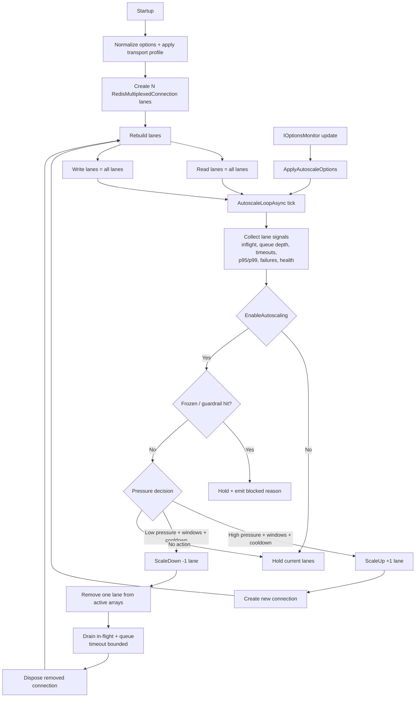

# Mux Fast Path Architecture

This is the operational map for `RedisCommandExecutor` and `RedisMultiplexedConnection` fast-path behavior.
Use this as the source of truth for lane routing, connection management, and tuning knobs.

## Fast Path Flow (Request -> Response)

```mermaid
flowchart LR
    A[App Command] --> B[HybridCommandExecutor]
    B --> C[RedisCommandExecutor]
    C --> D{Read or Write Command}
    D -->|Read| E[NextRead]
    D -->|Write| F[NextWrite]
    E --> G[Power-of-two lane pick<br/>lower lane score wins]
    F --> G
    G --> H[RedisMultiplexedConnection]
    H --> I{In-flight slot available}
    I -->|Yes| J[Try enqueue to writes ring]
    I -->|No| K[Wait for slot then enqueue]
    J --> L[WriterLoopAsync]
    K --> L
    L --> M{EnableCoalescedSocketWrites}
    M -->|true| N[CoalescedWriteDispatcher<br/>build adaptive batch]
    M -->|false| O[SendDirectAsync]
    N --> P[Socket.SendAsync vectored/fallback]
    O --> P
    P --> Q[Assign response sequence ids<br/>enqueue pending ops]
    Q --> R[ReaderLoopAsync]
    R --> S{EnableSocketRespReader}
    S -->|true| T[RedisRespSocketReaderState]
    S -->|false| U[RedisRespReaderState]
    T --> V[ResponseReaderLoop]
    U --> V
    V --> W[Complete PendingOperation]
    W --> X[Caller receives response]
```





## Lane + Connection Management





## Fastest Path Guidance

Use the fastest path for your target SLO, not just max batching.

- Throughput-first hot path:
  - `TransportProfile=FullTilt`
  - `EnableCoalescedSocketWrites=true`
  - `EnableAdaptiveCoalescing=true`
  - Keep lane count high enough to avoid queue spikes
- Low-tail-latency path:
  - `TransportProfile=LowLatency` or `Custom` with smaller coalesced limits
  - Keep queue depth near zero by increasing lanes before increasing batch size
- Experimental path (validate before broad rollout):
  - `EnableSocketRespReader=true`
  - `UseDedicatedLaneWorkers=true`

## Tuning Knobs (Mapped 1:1)

| Knob | Purpose | Throughput Bias | Latency Bias |
|---|---|---|---|
| `TransportProfile` | Applies profile defaults | `FullTilt` | `LowLatency` |
| `Connections` | Initial lane count | Higher | Moderate/high |
| `MaxInFlightPerConnection` | Per-lane concurrency ceiling | Higher | Moderate |
| `EnableCoalescedSocketWrites` | Coalesced socket send path | `true` | Usually `true` |
| `EnableAdaptiveCoalescing` | Queue-aware batching | `true` | `true` |
| `CoalescedWriteMaxBytes` | Max bytes per coalesced batch | Higher | Lower |
| `CoalescedWriteMaxSegments` | Max segments per coalesced batch | Higher | Lower |
| `CoalescedWriteSmallCopyThresholdBytes` | Scratch-copy cutoff | Higher | Lower |
| `AdaptiveCoalescingLowDepth` | Low-depth threshold | Lower | Lower |
| `AdaptiveCoalescingHighDepth` | High-depth threshold | Higher | Lower |
| `AdaptiveCoalescingMinWriteBytes` | Min bytes in low-depth mode | Higher | Lower |
| `AdaptiveCoalescingMinSegments` | Min segments in low-depth mode | Higher | Lower |
| `AdaptiveCoalescingMinSmallCopyThresholdBytes` | Min scratch-copy cutoff | Higher | Lower |
| `EnableSocketRespReader` | Socket-native RESP reader | `true` after validation | `true` after validation |
| `UseDedicatedLaneWorkers` | LongRunning lane workers | `true` under sustained CPU pressure | `false` unless needed |
| `ResponseTimeout` | Per-command timeout guardrail | Moderate | Moderate |

Autoscaler knobs (Enterprise): `EnableAutoscaling`, `MinConnections`, `MaxConnections`, cooldown/window/threshold/freeze controls.

## Aggressive Baseline (Maximum Throughput)

Use this as a starting point for a throughput-focused environment, then tune with real p99 and timeout data.

```json
{
  "RedisMultiplexer": {
    "TransportProfile": "FullTilt",
    "Connections": 8,
    "MaxInFlightPerConnection": 16384,
    "EnableCoalescedSocketWrites": true,
    "EnableAdaptiveCoalescing": true,
    "EnableSocketRespReader": true,
    "UseDedicatedLaneWorkers": true,
    "ResponseTimeout": "00:00:02",

    "EnableAutoscaling": true,
    "MinConnections": 6,
    "MaxConnections": 20,
    "AutoscaleSampleInterval": "00:00:01",
    "ScaleUpWindow": "00:00:08",
    "ScaleDownWindow": "00:02:00",
    "ScaleUpCooldown": "00:00:15",
    "ScaleDownCooldown": "00:01:30",
    "ScaleUpInflightUtilization": 0.75,
    "ScaleDownInflightUtilization": 0.25,
    "ScaleUpQueueDepthThreshold": 24,
    "ScaleUpTimeoutRatePerSecThreshold": 1.5,
    "ScaleUpP99LatencyMsThreshold": 35.0,
    "ScaleDownP95LatencyMsThreshold": 18.0
  }
}
```

If you are not on Enterprise features, keep `EnableAutoscaling=false` and tune `Connections` statically.

## Important Guardrail

If you want explicit coalescing byte/segment values to win, set:

- `TransportProfile=Custom`

Otherwise profile application will reset coalescing sizing to profile defaults.

## Rollout Order

1. Start with `FullTilt` + coalesced writes on + autoscaling off.
2. Tune lane count and in-flight caps to keep queue depth stable.
3. Enable autoscaling in advisor mode, then active mode.
4. Enable `EnableSocketRespReader`, validate, then consider `UseDedicatedLaneWorkers`.

## Benchmarking Link

Use [HOT_PATH_BENCHMARK_CHECKLIST.md](HOT_PATH_BENCHMARK_CHECKLIST.md) when validating mux tuning changes.

## Diagram Regeneration

To regenerate SVG assets from Mermaid sources:

```powershell
powershell -ExecutionPolicy Bypass -File tools/render-mux-diagrams.ps1
```
