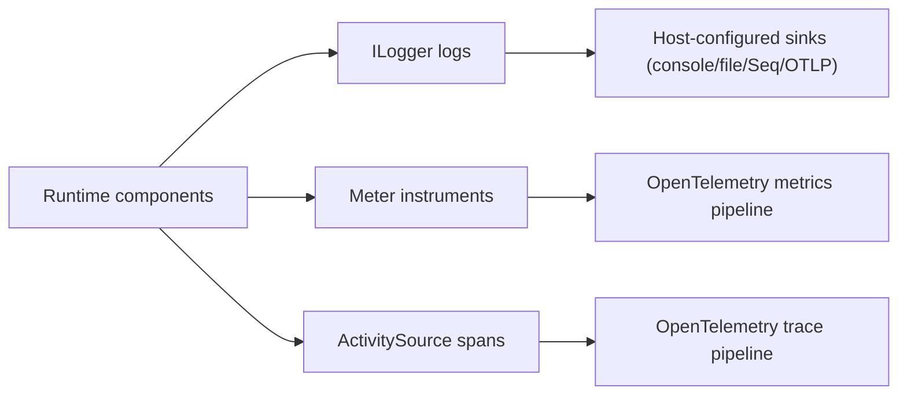
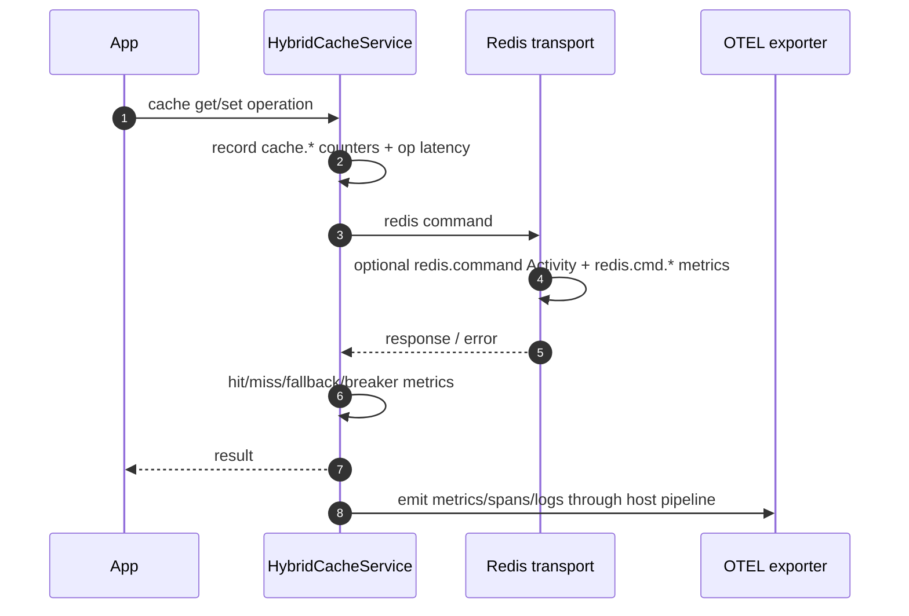
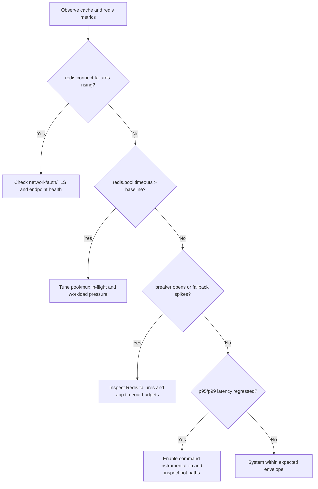

# Observability Specification

This document defines the concrete observability surface for VapeCache runtime components.

## 1. Scope

This spec covers:

- metrics names and meters
- tracing sources and activity names
- logging surfaces and event families
- instrumentation toggles and expected behavior

## 2. Signal Model

VapeCache emits three signal types:

- logs via `ILogger<T>`
- metrics via `System.Diagnostics.Metrics`
- traces via `System.Diagnostics.ActivitySource`

No sink backend is hardcoded in runtime packages.

### 2.1 Signal Topology

## 3. Metric Meters

### 3.1 Redis meter

Meter name: `VapeCache.Redis`

Primary instruments:

- connection: `redis.connect.attempts`, `redis.connect.failures`, `redis.connect.ms`
- pool: `redis.pool.acquires`, `redis.pool.timeouts`, `redis.pool.wait.ms`, `redis.pool.drops`, `redis.pool.reaps`, `redis.pool.validations`, `redis.pool.validation.failures`
- command: `redis.cmd.calls`, `redis.cmd.failures`, `redis.cmd.ms`
- queues and mux: `redis.queue.depth`, `redis.queue.wait.ms`, `redis.mux.lane.*`
- parser: `redis.parser.frames`, `redis.parser.bytes.parsed`, `redis.parser.frame.ms`, `redis.parser.frames_per_sec`, `redis.parser.bytes_per_sec`
- bytes/coalescing: `redis.bytes.sent`, `redis.bytes.received`, `redis.coalesced.batches`, `redis.coalesced.batch.bytes`, `redis.coalesced.batch.segments`

### 3.2 Cache meter

Meter name: `VapeCache.Cache`

Primary instruments:

- operation counters: `cache.get.calls`, `cache.set.calls`, `cache.remove.calls`
- hit/miss: `cache.get.hits`, `cache.get.misses`
- fallback/breaker: `cache.fallback.to_memory`, `cache.redis.breaker.opened`
- stampede controls: `cache.stampede.key_rejected`, `cache.stampede.lock_wait_timeout`, `cache.stampede.failure_backoff_rejected`
- latency/size: `cache.op.ms`, `cache.set.payload.bytes`, `cache.set.large_key`
- spill diagnostics: `cache.spill.*`
- backend state gauge: `cache.current.backend`

## 4. Tracing Surface

Activity source: `VapeCache.Redis`

Activity names:

- `redis.connect`
- `redis.command`

Base tags include:

- `db.system=redis`
- `db.operation` (for command spans)

### 4.1 Request Correlation Sequence

## 5. Instrumentation Toggles

`RedisMultiplexerOptions.EnableCommandInstrumentation` controls command-level command metrics and spans.

- default value: `false`
- when `false`:
  - command metrics (`redis.cmd.*`) are not recorded
  - `redis.command` activities are not created
- when `true`:
  - command metrics and `redis.command` spans are emitted

Connection-level metrics and non-command runtime metrics remain available independently.

## 6. Logging Surface

Runtime logs are emitted through `ILogger<T>` with structured fields.

Notable event families:

- output-cache store events (IDs `1001-1003`)
- hybrid cache breaker/failover events (IDs `7007-7017`)
- Redis connection factory events (IDs `5201-5207`)
- Redis pool events (IDs `12000-12014`)

## 7. Optional Logging Package

`VapeCache.Extensions.Logging` provides optional Serilog host wiring.

Key behaviors:

- production default minimum level can be forced to warning when not explicitly configured
- optional sinks: console, file, Seq, OTLP
- optional JSON formatting via:
  - `IVapeCacheJsonLogFormatterResolver`
  - `Serilog:Json:*` settings

This package is an adapter; runtime packages stay on `ILogger<T>`.

## 8. Minimum Production Baseline

At minimum, production deployments should monitor:

- connection failures (`redis.connect.failures`)
- pool timeouts (`redis.pool.timeouts`)
- breaker opens (`cache.redis.breaker.opened`)
- fallback rate (`cache.fallback.to_memory`)
- p95/p99 latency from `cache.op.ms` and `redis.cmd.ms` (when enabled)

### 8.1 Alerting Decision Flow

## 9. Cardinality Notes

- tags such as `connection.id` and `reason` are intentionally used on some metrics
- do not attach unbounded user/entity identifiers as metric tags
- keep high-cardinality dimensions in logs, not metric labels

## 10. Compatibility Notes

Metric and activity names in this spec are tied to current implementation.
When adding new telemetry, prefer additive changes and avoid renaming existing instruments without explicit migration notes.
