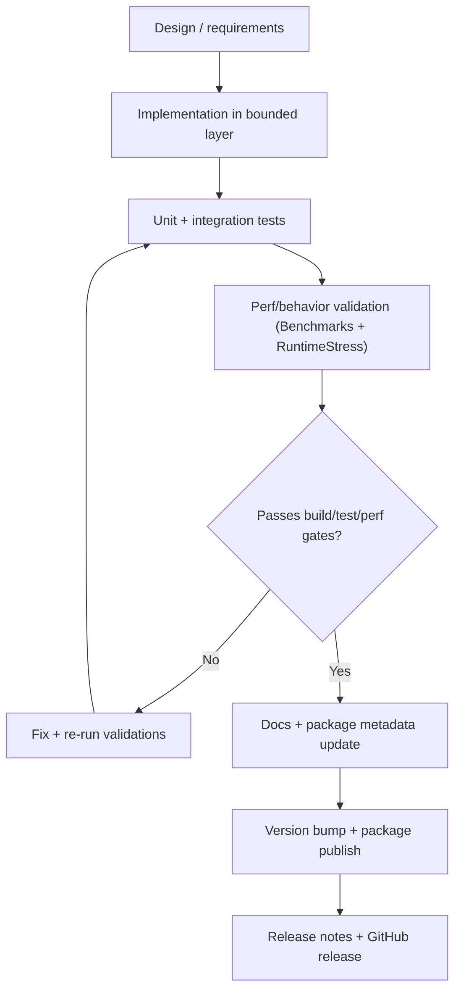
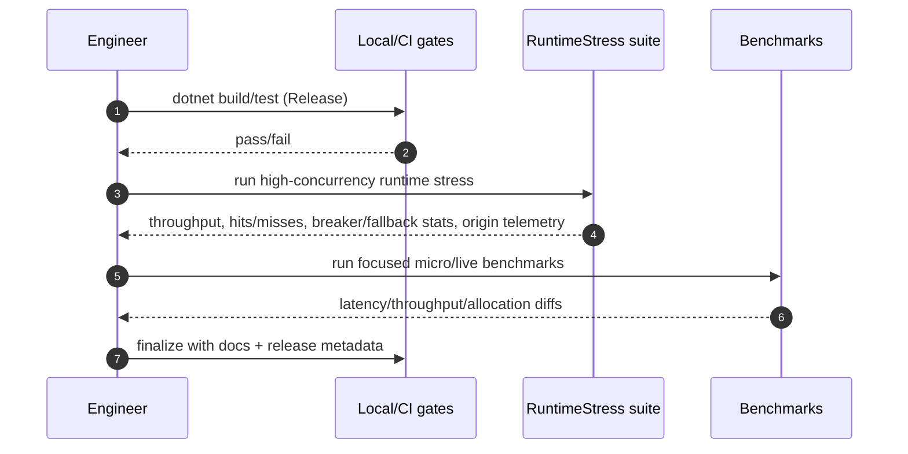
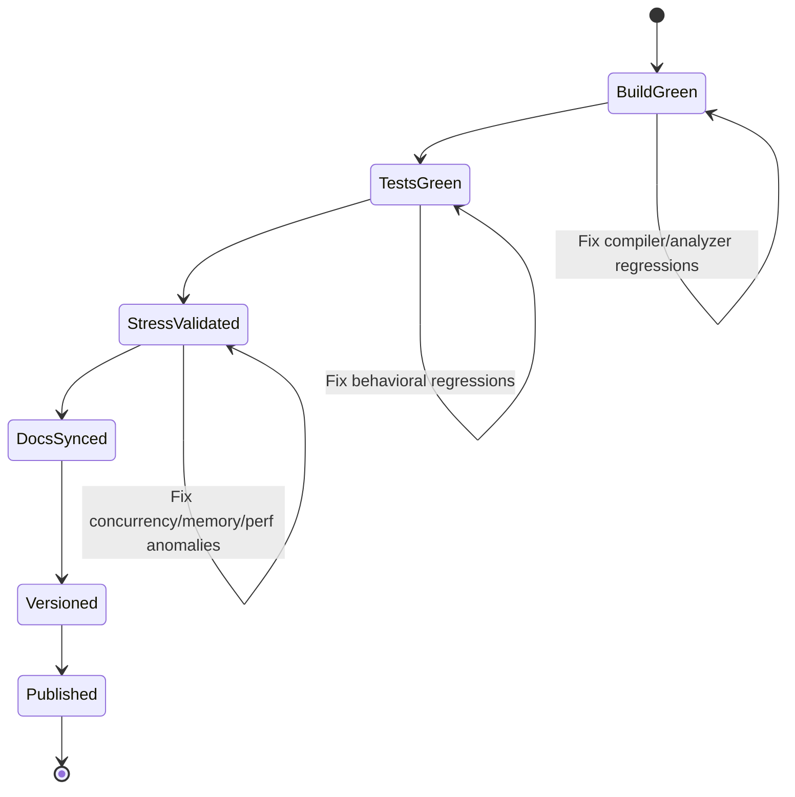

# Process Model

This document defines the engineering process model used to move runtime changes from implementation to release with low surprise.

## 1. Change Lifecycle

## 2. Runtime Validation Loop

## 3. No-Surprises Release Gate

## 4. Required Evidence Before Publish

- Release build succeeds with zero errors.
- Core test suites pass.
- Runtime stress run shows stable breaker/fallback behavior and sane hit/miss accounting.
- Benchmark run completes the relevant focused track and reports integrity metrics.
- Memory trend sampling does not show unbounded process growth during stress.
- Docs and package matrices match current published package set.
