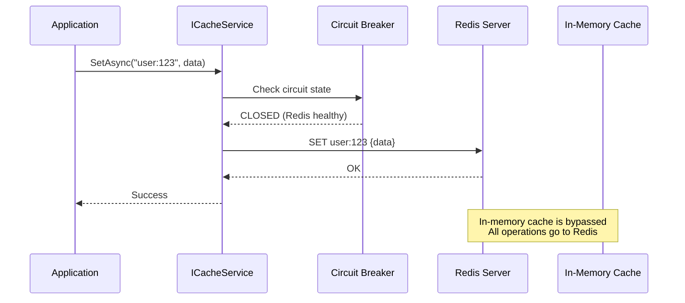
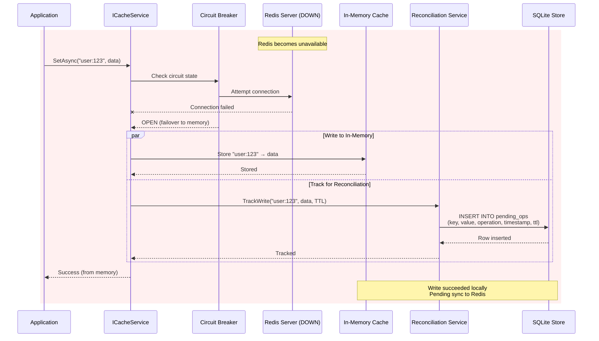
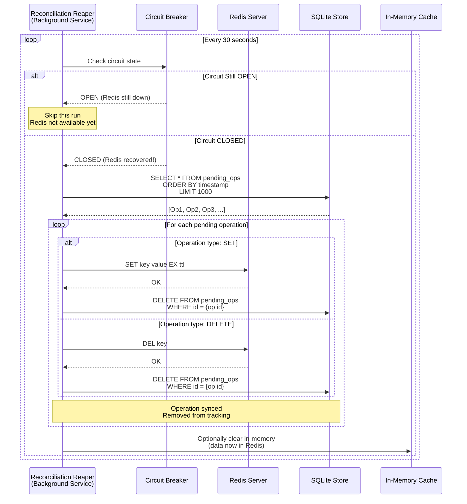
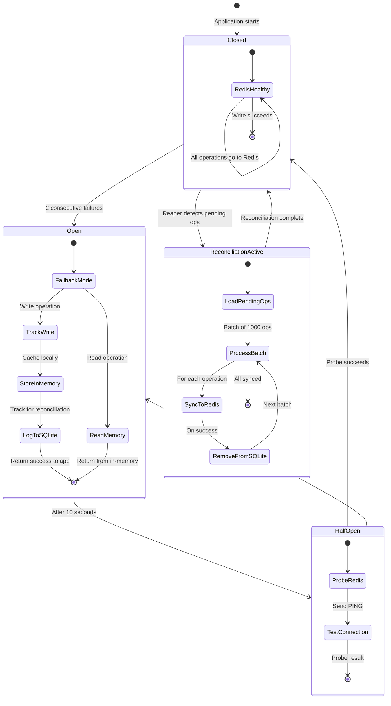
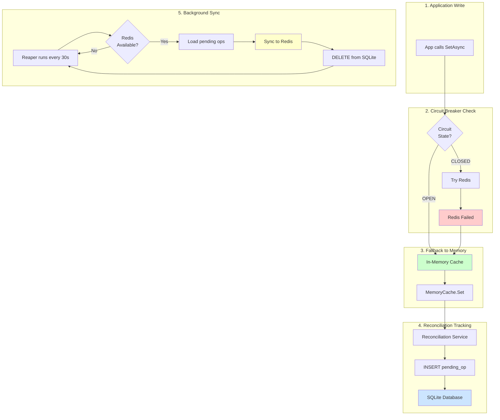
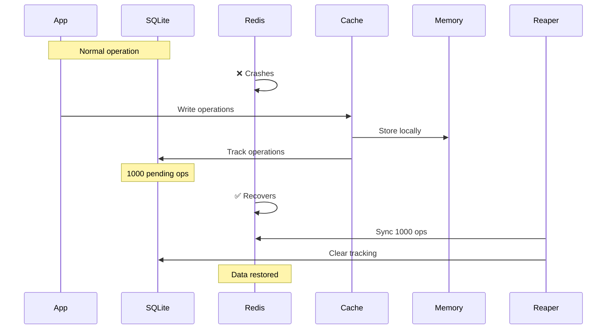
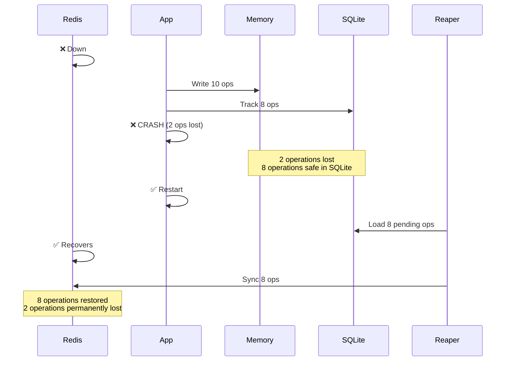
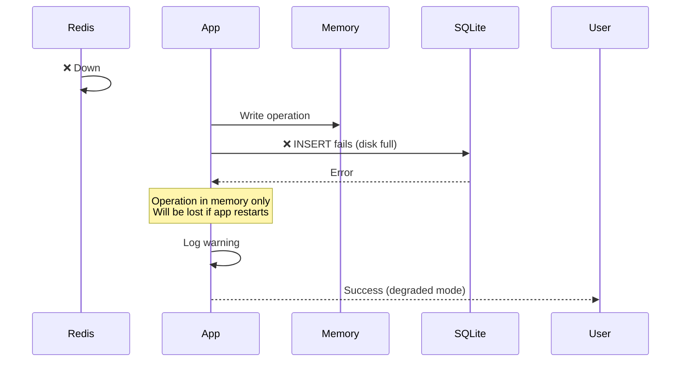

# VapeCache Reconciliation Architecture

## Overview

This document explains how VapeCache's data loss mitigation works through hybrid caching with SQLite-backed reconciliation.

---

## High-Level Architecture: Normal Operation (Redis Available)



---

## Reconciliation Flow: Redis Outage with SQLite Tracking



---

## Reconciliation Reaper: Automatic Sync-Back



---

## Complete State Diagram: Circuit Breaker + Reconciliation



---

## Data Flow: Complete Write Journey During Outage



---

## SQLite Schema

```sql
CREATE TABLE pending_operations (
    id INTEGER PRIMARY KEY AUTOINCREMENT,
    key TEXT NOT NULL,
    value BLOB,
    operation TEXT NOT NULL,  -- 'SET' or 'DELETE'
    timestamp INTEGER NOT NULL,
    ttl_seconds INTEGER,
    created_at TEXT DEFAULT CURRENT_TIMESTAMP
);

CREATE INDEX idx_timestamp ON pending_operations(timestamp);
CREATE INDEX idx_key ON pending_operations(key);
```

---

## Architecture Components

### 1. **ICacheService** (User-facing API)
- Provides `GetAsync`, `SetAsync`, `RemoveAsync` methods
- Abstracts underlying storage (Redis or Memory)
- Transparent to the application

### 2. **Circuit Breaker**
- Monitors Redis health
- States: CLOSED (healthy), OPEN (failed), HALF-OPEN (testing)
- Triggers failover to in-memory cache
- Auto-recovery after 10 seconds

### 3. **In-Memory Cache**
- `IMemoryCache` implementation
- Acts as fallback during Redis outages
- Temporary storage until Redis recovers
- Configurable TTL and size limits

### 4. **Reconciliation Service**
- Tracks writes that occurred during outage
- Stores operations in SQLite for durability
- Provides `ReconcileAsync()` method for manual sync

### 5. **Reconciliation Reaper**
- Background service (`IHostedService`)
- Runs every 30 seconds (configurable)
- Automatically syncs pending operations when Redis recovers
- Processes operations in batches (default: 1000)

### 6. **SQLite Backing Store**
- Durable storage for pending operations
- Survives application restarts
- Configurable path (default: `reconciliation.db`)
- Transactional integrity

---

## Failure Scenarios & Edge Cases

### Scenario 1: Redis Down, App Continues Running


### Scenario 2: App Crashes Before SQLite Flush


### Scenario 3: Disk Full / SQLite Fails


---

## Configuration Examples

### Minimal Configuration
```csharp
builder.Services.AddVapeCacheRedisReconciliation();
builder.Services.AddReconciliationReaper();
```

### Production Configuration
```json
{
  "RedisReconciliation": {
    "Enabled": true,
    "MaxPendingOperations": 500000,
    "MaxOperationsPerRun": 5000,
    "BatchSize": 500,
    "MaxOperationAge": "01:00:00"
  },
  "RedisReconciliationStore": {
    "UseSqlite": true,
    "DatabasePath": "/var/lib/vapecache/reconciliation.db",
    "BusyTimeoutMs": 30000
  },
  "RedisReconciliationReaper": {
    "Enabled": true,
    "Interval": "00:00:10",
    "InitialDelay": "00:00:05"
  }
}
```

---

## Performance Characteristics

### Write Performance During Outage
- **In-Memory Write**: ~1-2 μs (nanosecond-scale)
- **SQLite Insert**: ~100-500 μs (microsecond-scale)
- **Total Latency**: ~500 μs (vs 1-5ms for Redis over network)
- **Throughput**: 50K-100K writes/second to SQLite

### Reconciliation Performance
- **Batch Size**: 1000 operations (configurable)
- **Sync Rate**: 10K-50K ops/second to Redis (network dependent)
- **Recovery Time**: 10-30 seconds for 100K pending operations

### Storage Requirements
- **SQLite Overhead**: ~100 bytes per operation
- **100K pending operations**: ~10 MB disk space
- **500K pending operations**: ~50 MB disk space

---

## Best Practices

### 1. **Monitor Pending Operation Count**
```csharp
var pendingCount = reconciliationService.PendingOperations;
if (pendingCount > 50000)
{
    logger.LogWarning("High pending operation count: {Count}", pendingCount);
}
```

### 2. **Use Persistent SQLite Store**
```csharp
builder.Services.AddVapeCacheRedisReconciliation(configureStore: store =>
{
    store.DatabasePath = Path.Combine(
        Environment.GetFolderPath(Environment.SpecialFolder.CommonApplicationData),
        "VapeCache",
        "reconciliation.db"
    );
});
```

### 3. **Set Appropriate Batch Sizes**
For high-throughput applications:
```csharp
builder.Services.AddVapeCacheRedisReconciliation(configure: options =>
{
    options.MaxOperationsPerRun = 10000;  // Process 10K ops per run
    options.BatchSize = 1000;              // 1K ops per Redis batch
});
```

### 4. **Alert on Dropped Operations**
```csharp
// Monitor OpenTelemetry metric
vapecache_reconciliation_dropped_total
```

---

## Limitations & Caveats

### What Reconciliation **CAN** Do:
✅ Mitigate data loss during **transient Redis outages**
✅ Survive **application restarts** (operations persisted in SQLite)
✅ Handle **thousands of writes per second** during outage
✅ Automatically sync back when Redis recovers

### What Reconciliation **CANNOT** Do:
❌ Guarantee zero data loss in **all scenarios**
❌ Survive **disk failures** (SQLite is on disk)
❌ Prevent loss on **immediate application crash** (unflushed writes)
❌ Handle **conflicting writes** across multiple application instances
❌ Provide **ACID guarantees** across distributed systems

---

## Comparison with Alternatives

| Feature | VapeCache Reconciliation | Write-Through Cache | Event Sourcing |
|---------|-------------------------|---------------------|----------------|
| **Data Loss Mitigation** | ✅ Yes (SQLite tracking) | ❌ No (fails if Redis down) | ✅ Yes (event log) |
| **Performance Impact** | Low (~500μs per write) | None (direct Redis) | High (log + projections) |
| **Complexity** | Medium | Low | High |
| **Recovery Time** | Seconds-minutes | N/A | Minutes-hours |
| **Storage Overhead** | ~100 bytes/op | None | High (full event history) |
| **Best For** | Mitigating transient outages | Normal operation | Full audit trail |

---

## See Also

- [VapeCache.Reconciliation Usage Guide](../VapeCache.Reconciliation/USAGE_GUIDE.md)
- [Circuit Breaker Documentation](CIRCUIT_BREAKER.md)
- [Failure Scenarios](FAILURE_SCENARIOS.md)
