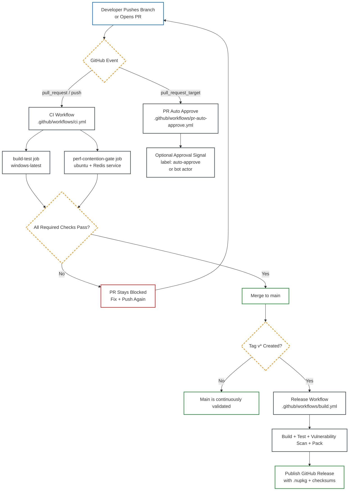
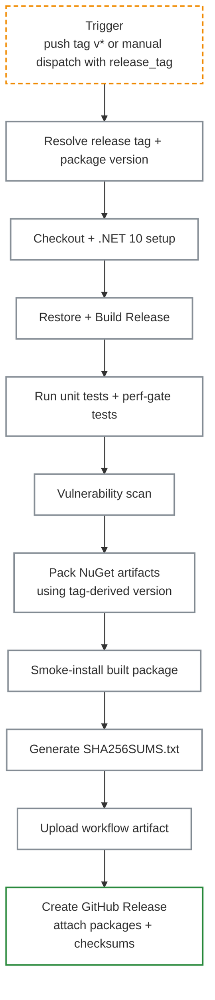

# CI/CD Workflows

This document maps VapeCache automation from first commit to release artifacts.

Style note: diagrams use transparent fills and high-contrast strokes to stay readable in both GitHub light and dark themes.

## 1. End-to-End Flow (Top to Bottom)



## 2. CI Workflow Internals

```mermaid
flowchart TB
    classDef job fill:transparent,stroke:#343a40,stroke-width:2px
    classDef step fill:transparent,stroke:#868e96,stroke-width:2px
    classDef gate fill:transparent,stroke:#f08c00,stroke-width:2px,stroke-dasharray: 6 4

    A[CI Trigger<br/>push / pull_request] --> B{Run Jobs in Parallel}:::gate

    subgraph W1[Job: build-test (windows-latest)]
      direction TB
      C1[Checkout]:::step --> C2[Setup .NET 10]:::step --> C3[Restore]:::step --> C4[Build Release]:::step --> C5[Run Unit Tests]:::step --> C6[Transport Regression Tests]:::step --> C7[Perf Gate Script]:::step
    end

    subgraph W2[Job: perf-contention-gate (ubuntu-latest)]
      direction TB
      D1[Start Redis service container]:::step --> D2[Checkout]:::step --> D3[Setup .NET 10]:::step --> D4[Restore]:::step --> D5[Run contention perf gate]:::step --> D6[Run grocery tail perf gate]:::step
    end

    B --> W1
    B --> W2
    W1 --> E{Both Jobs Pass?}:::gate
    W2 --> E
    E -->|Yes| F[Status: CI Green]
    E -->|No| G[Status: CI Red]
```

## 3. Release Workflow Internals



## 4. PR Auto-Approve Policy

```mermaid
flowchart TB
    classDef trigger fill:transparent,stroke:#1971c2,stroke-width:2px
    classDef gate fill:transparent,stroke:#f08c00,stroke-width:2px,stroke-dasharray: 6 4
    classDef success fill:transparent,stroke:#2b8a3e,stroke-width:2px
    classDef fail fill:transparent,stroke:#c92a2a,stroke-width:2px

    A[pull_request_target event]:::trigger --> B{Draft PR?}:::gate
    B -->|Yes| C[Skip]:::fail
    B -->|No| D{Matches policy?}:::gate
    D -->|Label auto-approve| E[Approve PR]:::success
    D -->|dependabot[bot]| E
    D -->|renovate[bot]| E
    D -->|No match| F[No auto-approval]:::fail
```

## 5. Commit Notification Feed

- Workflow: `.github/workflows/commit-notify.yml`
- Trigger: `push` to `main`, `master`, or tags matching `v*`, plus manual dispatch for verification.
- Delivery: branch pushes go to the `Commit Notifications` issue; release tags go to `Release Notifications`.
- Each run adds a comment summarizing the push or tag event.
- Recipients: handles from `.github/commit-notify-subscribers.txt` plus contributors whose git author email uses GitHub's noreply format.
- Result: contributors receive standard GitHub notifications from issue comment mentions without requiring external mail or chat infrastructure.

## 6. Release Notes

- Release workflow manual dispatch now requires a `release_tag` input (for example `v1.2.0` or `v1.2.0-rc1`).
- Package artifacts are versioned from the resolved tag, so prerelease tags generate matching prerelease `.nupkg` versions.
- `tools/pack-release-packages.ps1` validates that all packable projects share the same base version before packing.
- `tools/publish-release-packages.ps1` pushes packages in dependency-safe order when you are ready to publish to a NuGet feed.

