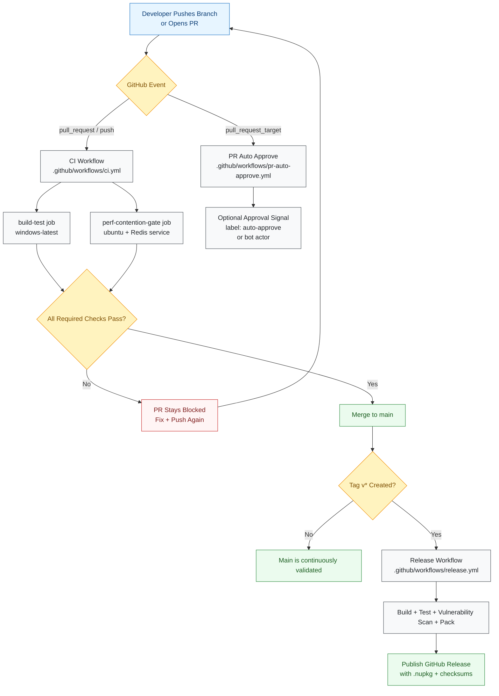
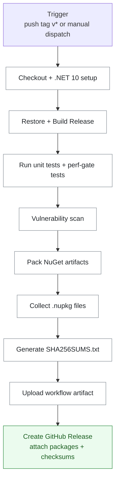

# CI/CD Workflows

This document maps VapeCache automation from first commit to release artifacts.

## 1. End-to-End Flow (Top to Bottom)



## 2. CI Workflow Internals

```mermaid
flowchart TB
    classDef job fill:#f1f3f5,stroke:#343a40,stroke-width:1px,color:#212529
    classDef step fill:#ffffff,stroke:#868e96,stroke-width:1px,color:#212529
    classDef gate fill:#fff3bf,stroke:#f08c00,stroke-width:1px,color:#7c4d00

    A[CI Trigger<br/>push / pull_request] --> B{Run Jobs in Parallel}:::gate

    subgraph W1[Job: build-test (windows-latest)]
      direction TB
      C1[Checkout]:::step --> C2[Setup .NET 10]:::step --> C3[Restore]:::step --> C4[Build Release]:::step --> C5[Run Unit Tests]:::step --> C6[Transport Regression Tests]:::step --> C7[Perf Gate Script]:::step
    end

    subgraph W2[Job: perf-contention-gate (ubuntu-latest)]
      direction TB
      D1[Start Redis service container]:::step --> D2[Checkout]:::step --> D3[Setup .NET 10]:::step --> D4[Restore]:::step --> D5[Run contention perf gate]:::step --> D6[Run grocery tail perf gate]:::step
    end

    B --> W1
    B --> W2
    W1 --> E{Both Jobs Pass?}:::gate
    W2 --> E
    E -->|Yes| F[Status: CI Green]
    E -->|No| G[Status: CI Red]
```

## 3. Release Workflow Internals



## 4. PR Auto-Approve Policy

```mermaid
flowchart TB
    A[pull_request_target event] --> B{Draft PR?}
    B -->|Yes| C[Skip]
    B -->|No| D{Matches policy?}
    D -->|Label auto-approve| E[Approve PR]
    D -->|dependabot[bot]| E
    D -->|renovate[bot]| E
    D -->|No match| F[No auto-approval]
```
