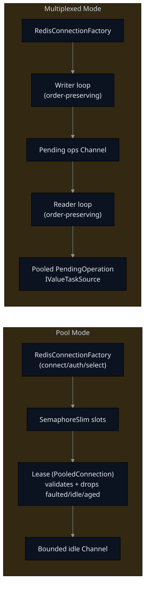
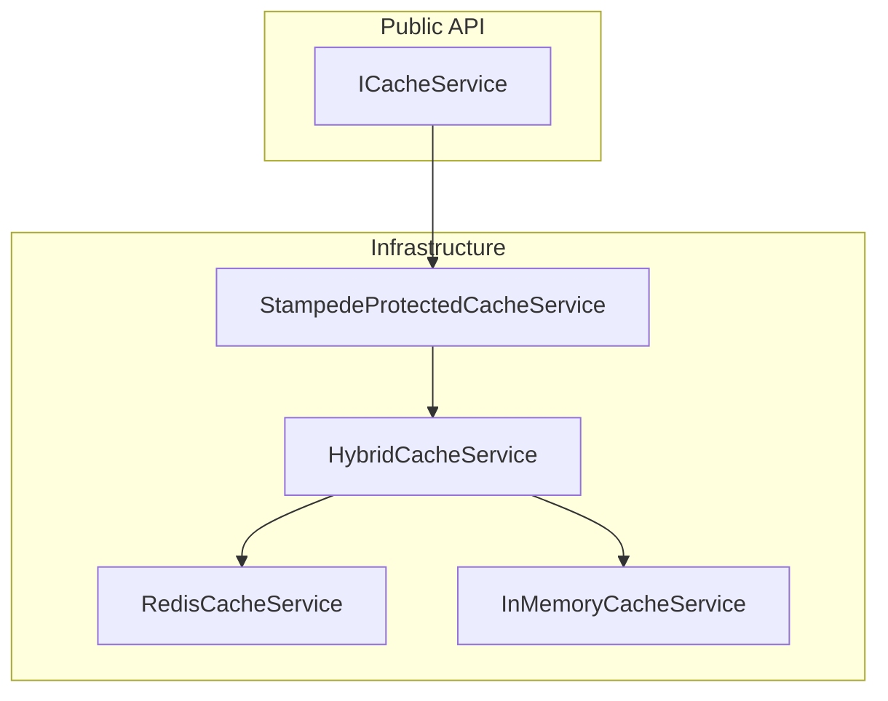

# Architecture Notes

This doc is intended for contributors and reviewers. Public usage docs live in `README.md`.

## Redis Transport Options
- Pooling: `RedisConnectionPool` for scenarios needing “one socket per lease” semantics.
- Multiplexing: `RedisMultiplexedConnection` for ordered pipelining over a single connection (higher throughput, lower socket churn).

### Transport design (high-level)


### Why this design vs StackExchange.Redis (SER)
- **Ordered pipelining without per-op Task allocations**: pooled `IValueTaskSource` operations avoid the `TaskCompletionSource` churn that dominates Gen0 in SER hot paths.
- **Deterministic buffer ownership**: response bulk values can be leased from `ArrayPool` and returned by the caller, eliminating payload-sized garbage and LOH risk.
- **Fail-fast and auto-reconnect**: writer/reader loops drain and fault all in-flight/pending commands on transport errors, dispose the dead socket, and re-establish on the next write; callers never hang on a broken channel.
- **Pool + mux symmetry**: both paths use explicit drop reasons (faulted/idle/max lifetime) so that reapers and borrowers never reuse bad sockets.
- **Telemetry-first**: every major edge (connect, pool acquire/validate, command duration, bytes) is tagged and histogrammed for OTLP export.

## Cache Composition


### Circuit breaker + stampede control
- `HybridCacheService` wraps Redis with a circuit breaker and half-open probe. Only one concurrent probe is allowed; all other requests fall back to memory while open.
- `StampedeProtectedCacheService` adds per-key semaphores to collapse thundering herds; a small refcounted dictionary is used with fail-open when the lock map grows beyond `MaxKeys`.

## Telemetry
### Metrics
- `VapeCache.Redis`: pool/connect/command metrics
- `VapeCache.Cache`: cache hit/miss/fallback + operation durations

### Dashboard approach (Blazor later)
Recommended:
- export to an OTLP backend (Grafana/Tempo/Prometheus/OTel-Collector)
- or export to a metrics backend and query/aggregate there

Optional hybrid:
- write a periodic *snapshot* into Redis (coarse rollups only) to let a Blazor UI display “last known stats” even when OTLP is unavailable.

## Performance notes
- **Allocation profile (mux GET/HGET/LPOP hot path)**: after switching to pooled `IValueTaskSource` ops the hot path allocates ~2.1 KB/op (mostly RESP value graphs and small strings), down from ~2.7 KB/op. Payload bytes are pooled and not counted in that number.
- **In-flight limiter**: slots are released only after the response is drained, preventing runaway concurrency when calls are canceled.
- **Reconnect behavior**: any socket/read/write exception drains pending + queued requests, releases in-flight slots, disposes the broken transport, and the next write recreates the connection. No caller hangs on half-written commands.
- **What still allocates**: RESP arrays (MGET/LRANGE/HMGET) allocate `RespValue[]` and per-item byte[] by design; to push lower, replace the `Channel` pipeline with a lock-free ring and custom reader that reuses array leases.

## Benchmark guidance (SER vs VapeCache)
Run the existing BenchmarkDotNet project for both libraries using identical workloads (GET/SET, varying payload sizes, multiplexed mode). Suggested command:
```
dotnet run -c Release --project VapeCache.Benchmarks -- --filter *RedisClientComparisonBenchmarks* --export-json bench.json
```
Then run a StackExchange.Redis twin benchmark (same payload/key patterns) and compare:
- **Throughput (ops/sec)** and **p99 latency**
- **Allocated bytes/op** and **Gen0 collections/sec**
- **LOH allocations** (watch for large payloads)

Add results into a side-by-side table in `README.md` once captured. Use `Paranoia` mode to enable unsafe codecs if you need to squeeze the last few µs.
