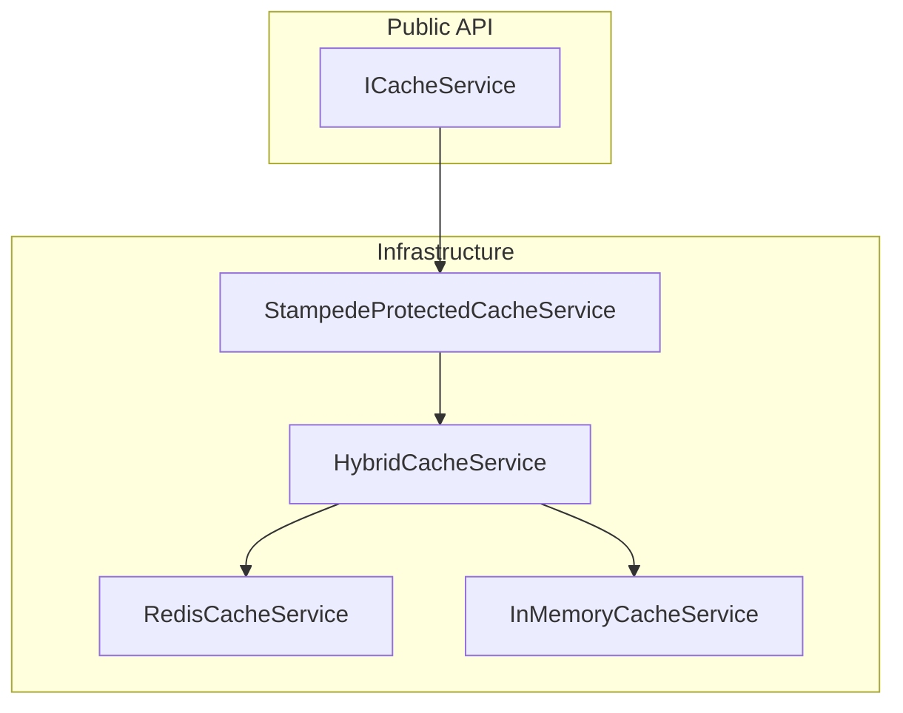

# Architecture Notes

This doc is intended for contributors and reviewers. Public usage docs live in `README.md`.

## Redis Transport Options
- Pooling: `RedisConnectionPool` for scenarios needing “one socket per lease” semantics.
- Multiplexing: `RedisMultiplexedConnection` for ordered pipelining over a single connection (higher throughput, lower socket churn).

## Cache Composition

## Telemetry
### Metrics
- `VapeCache.Redis`: pool/connect/command metrics
- `VapeCache.Cache`: cache hit/miss/fallback + operation durations

### Dashboard approach (Blazor later)
Recommended:
- export to an OTLP backend (Grafana/Tempo/Prometheus/OTel-Collector)
- or export to a metrics backend and query/aggregate there

Optional hybrid:
- write a periodic *snapshot* into Redis (coarse rollups only) to let a Blazor UI display “last known stats” even when OTLP is unavailable.

